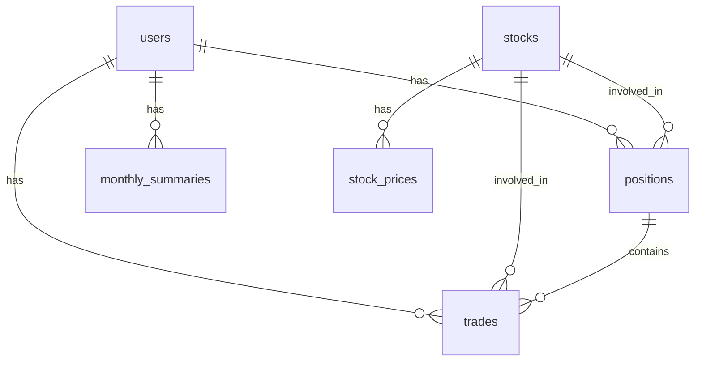

# 株式トレード管理アプリケーション

複数ユーザーが利用できる株式トレード管理アプリケーションです。各トレードデータを最小限の入力で登録し、ポジション単位で管理することで買い増しや一部売却にも対応。月次でのパフォーマンスサマリーを確認できるシステムを提供します。

## 目的

- スプレッドシートでの管理から移行し、データ入力の効率化を図る
- トレードデータのコピー&修正作業を削減
- 複雑な売買パターン（買い増し、一部売却）にも対応
- 月次パフォーマンスの把握を容易にする

## 技術スタック

- **フロントエンド**: React (TypeScript) + Vite
- **バックエンド**: Laravel (PHP)
- **データベース**: MySQL/PostgreSQL

## システム構成

### フロントエンド構成

- React + TypeScript + Vite
- TailwindCSS によるスタイリング
- レスポンシブデザインによるスマートフォン対応

### バックエンド構成

- Laravel フレームワーク
- RESTful API の提供
- JWT 認証

### データベース設計概要

主要テーブル構成：



詳細なデータベース設計は [docs/database_design.md](docs/database_design.md) を参照してください。

## 主要機能

### ユーザー管理

- 複数ユーザーが独立してトレードデータを管理
- ユーザー登録・ログイン機能
- シンプルなランディングページからの新規登録・ログインフロー

### トレードデータ管理

- トレードデータの登録（最小限の入力項目）
  - 銘柄コード（銘柄名は自動表示）
  - 売買種別（買い/売り）
  - 金額（手数料込みの合計金額）
  - トレード日（デフォルトは現在日付）
  - 取引種別（現物/信用、デフォルト値あり）
  - 備考（任意）
- 自動入力機能
  - 銘柄コード入力時に銘柄名を自動表示
  - 買い増し・売却時に銘柄情報を自動入力
  - 損益計算の自動化

### ポジション管理

- 銘柄ごとのポジション自動管理
- 買い増し・一部売却・全売却の簡易操作
- 損益の自動計算

### トレード一覧表示

- 日付順表示と銘柄グループ表示の 2 つのモード
- グラフィカル表示による直感的な損益状況の把握
- 銘柄詳細ビューによるトレード履歴の確認

### サマリー機能

- 月次サマリーの表示
  - 平均利益
  - 平均損失率
  - 平均利益率
  - 総トレード数
  - 最大利益率
  - 最大損失率
  - 先月との変化率

## 開発環境のセットアップ

### 必要な依存関係

- Node.js (v18 以上)
- PHP (v8.1 以上)
- Composer
- MySQL または PostgreSQL

### フロントエンドのセットアップ

```bash
# フロントエンドディレクトリに移動
cd frontend

# 依存パッケージのインストール
npm install

# 開発サーバーの起動
npm run dev
```

### バックエンドのセットアップ

```bash
# バックエンドディレクトリに移動
cd backend

# 依存パッケージのインストール
composer install

# .env ファイルの作成
cp .env.example .env

# アプリケーションキーの生成
php artisan key:generate

# データベースのマイグレーション
php artisan migrate

# 開発サーバーの起動
php artisan serve
```

### 環境変数の設定

バックエンドの `.env` ファイルで以下の設定を行ってください：

- データベース接続情報
- API キー（必要な場合）
- その他の環境固有の設定

## 開発ロードマップ

### フェーズ 1（MVP - 最小実用製品）

**目標**: 基本的なトレード記録と表示機能の実現

- ユーザー登録・認証機能
- 基本的なトレードデータ登録機能
- 日付順のトレード一覧表示
- 基本的な月次サマリー表示

### フェーズ 2（機能拡張）

**目標**: ユーザビリティの向上と表示機能の強化

- トレードデータ入力の自動化機能強化
- 銘柄グループ表示の実装
- 月次サマリーの詳細化
- レスポンシブデザインの最適化

### フェーズ 3（高度な機能）

**目標**: 分析機能と拡張機能の追加

- 銘柄ごとのパフォーマンス分析
- グラフィカル表示の強化
- カスタムレポート機能
- データのインポート/エクスポート機能

詳細な要件は [docs/要件定義書.md](docs/要件定義書.md) を参照してください。

## ライセンス

このプロジェクトは [MIT ライセンス](LICENSE) の下で公開されています。
