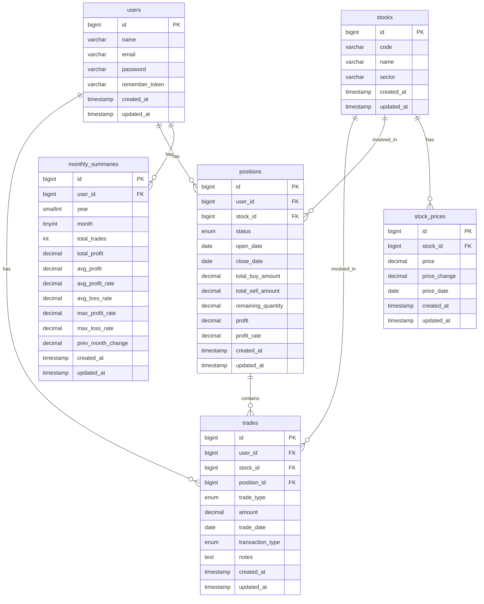
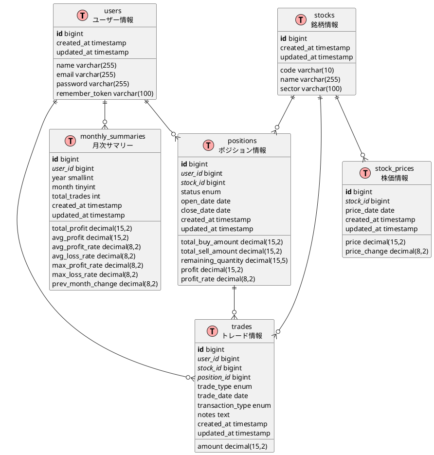

# 株式トレード管理アプリケーション データベース設計

## 1. テーブル構造

### users テーブル

ユーザー情報を管理するテーブル

```
users
- id (PK): bigint, auto_increment
- name: varchar(255), ユーザー名
- email: varchar(255), unique, メールアドレス
- password: varchar(255), ハッシュ化されたパスワード
- remember_token: varchar(100), null, ログイン維持用トークン
- created_at: timestamp
- updated_at: timestamp
```

### stocks テーブル

銘柄情報を管理するテーブル

```
stocks
- id (PK): bigint, auto_increment
- code: varchar(10), unique, 銘柄コード
- name: varchar(255), 銘柄名
- sector: varchar(100), null, 業種
- created_at: timestamp
- updated_at: timestamp
```

### trades テーブル

個々のトレード情報を管理するテーブル

```
trades
- id (PK): bigint, auto_increment
- user_id (FK): bigint, usersテーブルへの外部キー
- stock_id (FK): bigint, stocksテーブルへの外部キー
- position_id (FK): bigint, null, positionsテーブルへの外部キー
- trade_type: enum('buy', 'sell'), 売買種別（買い/売り）
- amount: decimal(15, 2), 金額（手数料込み）
- trade_date: date, トレード日
- transaction_type: enum('spot', 'margin'), default='spot', 取引種別（現物/信用）
- notes: text, null, 備考
- created_at: timestamp
- updated_at: timestamp
```

### positions テーブル

ポジション情報を管理するテーブル

```
positions
- id (PK): bigint, auto_increment
- user_id (FK): bigint, usersテーブルへの外部キー
- stock_id (FK): bigint, stocksテーブルへの外部キー
- status: enum('active', 'closed'), ポジションの状態
- open_date: date, ポジションオープン日
- close_date: date, null, ポジションクローズ日
- total_buy_amount: decimal(15, 2), 総購入金額
- total_sell_amount: decimal(15, 2), default=0, 総売却金額
- remaining_quantity: decimal(15, 5), 残数量（一部売却対応）
- profit: decimal(15, 2), null, 確定損益
- profit_rate: decimal(8, 2), null, 確定損益率
- created_at: timestamp
- updated_at: timestamp
```

### stock_prices テーブル

銘柄の価格情報を管理するテーブル（現在値の表示や未実現損益の計算に使用）

```
stock_prices
- id (PK): bigint, auto_increment
- stock_id (FK): bigint, stocksテーブルへの外部キー
- price: decimal(15, 2), 株価
- price_change: decimal(8, 2), 前日比変動率
- price_date: date, 価格日付
- created_at: timestamp
- updated_at: timestamp
```

### monthly_summaries テーブル

月次サマリー情報を管理するテーブル

```
monthly_summaries
- id (PK): bigint, auto_increment
- user_id (FK): bigint, usersテーブルへの外部キー
- year: smallint, 年
- month: tinyint, 月
- total_trades: int, 総トレード数
- total_profit: decimal(15, 2), 総利益
- avg_profit: decimal(15, 2), 平均利益
- avg_profit_rate: decimal(8, 2), 平均利益率
- avg_loss_rate: decimal(8, 2), 平均損失率
- max_profit_rate: decimal(8, 2), 最大利益率
- max_loss_rate: decimal(8, 2), 最大損失率
- prev_month_change: decimal(8, 2), null, 先月比変化率
- created_at: timestamp
- updated_at: timestamp
```

## 2. リレーションシップ

以下は Mermaid 記法による ER 図です。GitHub などのマークダウンビューアで表示できます。



また、以下は PlantUML 記法による ER 図です。PlantUML をサポートするツールで表示できます。



## 3. インデックス設計

### users テーブル

- email (unique)

### stocks テーブル

- code (unique)

### trades テーブル

- user_id, trade_date (複合インデックス、ユーザーごとの日付検索を高速化)
- stock_id (銘柄ごとの検索を高速化)
- position_id (ポジションごとの検索を高速化)

### positions テーブル

- user_id, stock_id, status (複合インデックス、ユーザーごとの銘柄・状態検索を高速化)

### stock_prices テーブル

- stock_id, price_date (複合インデックス、特定日の銘柄価格検索を高速化)

### monthly_summaries テーブル

- user_id, year, month (複合インデックス、ユーザーごとの年月検索を高速化)

## 4. 主要なデータフロー

### トレード登録時のフロー

1. 銘柄コード入力時に stocks テーブルから銘柄情報を自動取得
2. トレードが「買い」の場合：
   - 同じ銘柄の active なポジションがあれば、そのポジションに関連付け
   - なければ新しいポジションを作成
3. トレードが「売り」の場合：
   - 同じ銘柄の active なポジションに関連付け
   - ポジションの remaining_quantity を更新
   - 全売却の場合は status を closed に変更
   - 損益計算を行い、ポジションの profit と profit_rate を更新

### 月次サマリー計算のフロー

1. 月末または月初に、前月のトレードデータを集計
2. 集計結果を monthly_summaries テーブルに保存
3. 前月のデータがある場合は、prev_month_change を計算して更新

## 5. 考慮事項

### スケーラビリティ

- stock_prices テーブルは時間とともに大きくなるため、パーティショニングやアーカイブ戦略が必要になる可能性があります
- 長期運用を考慮し、trades テーブルも年単位でパーティショニングを検討

### パフォーマンス

- 月次サマリーの計算は重い処理になる可能性があるため、バックグラウンドジョブでの実行を検討
- 頻繁に参照される直近のデータにはキャッシュ戦略を適用

### データ整合性

- トレードとポジションの関連付けには、トランザクション処理を適用して整合性を確保
- 売却時の損益計算には、FIFO（先入れ先出し）などの明確な計算ルールを適用
