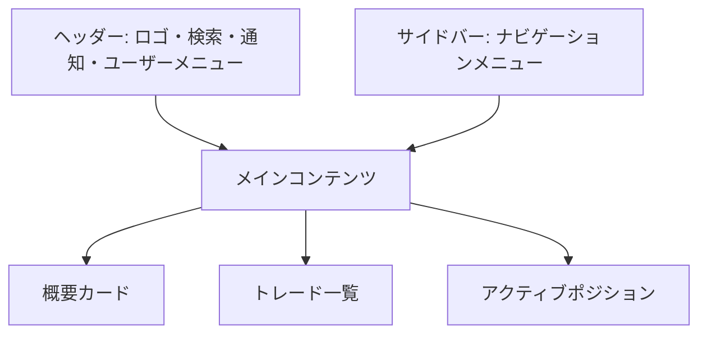

# 画面詳細設計書：ダッシュボード画面

## 1. 画面の目的と概要

**目的**：

- ユーザーのトレード活動の概要を一目で把握できる情報を提供する
- 最近のトレード履歴を表示し、素早くアクセスできるようにする
- アクティブなポジションの状況を確認できるようにする
- アプリケーションの主要機能へのナビゲーションを提供する

**概要**：
ダッシュボード画面は、ユーザーがログイン後に最初に表示される中心的な画面です。TradingView 風のダークテーマを採用し、トレード管理に必要な主要情報を視覚的にわかりやすく表示します。サイドバーによるナビゲーション、概要カード、トレード一覧、アクティブポジションの 3 つの主要セクションで構成されています。

## 2. 画面レイアウト



## 3. 主要コンポーネント

### 3.1 ヘッダー

- **ロゴ**: アプリケーション名「Trade Manager」とアイコン
- **検索バー**: 銘柄検索機能
- **通知アイコン**: 未読通知の表示
- **ユーザーアバター**: クリックでユーザーメニューを表示

### 3.2 サイドバー

- **ナビゲーションメニュー**:
  - ダッシュボード（現在のページ、アクティブ状態）
  - トレード一覧
  - 月次サマリー
  - 設定

### 3.3 概要カード

3 つのカードを横並びに配置:

1. **今月の実現損益**:

   - 金額表示（例: +¥43,850）
   - 先月比の変化率（例: +15.2%）
   - 上昇/下降を示すアイコンと色分け（利益: 緑、損失: 赤）

2. **未実現損益**:

   - 金額表示（例: +¥10,000）
   - 保有銘柄数の表示（例: 2 銘柄保有中）
   - 上昇/下降を示すアイコンと色分け

3. **月間平均利益率**:
   - パーセンテージ表示（例: 7.6%）
   - 最大利益率の表示（例: 最大: 9.0%）
   - 上昇/下降を示すアイコンと色分け

### 3.4 トレード一覧セクション

- **セクションヘッダー**:

  - タイトル「トレード一覧（2025 年 3 月）」
  - 表示切替ボタン（日付順/銘柄グループ）
  - 「新規トレード」ボタン

- **日付順表示モード**:

  - テーブル形式で表示
  - 列: 日付、銘柄、売買、金額、損益、損益率
  - 各行はトレード 1 件を表示
  - 銘柄情報には銘柄名、コード、セクター、現在価格、価格変動率を含む
  - 売買種別は色分け（買い: 青、売り: 赤）
  - 損益と損益率は色分け（利益: 緑、損失: 赤）

- **銘柄グループ表示モード**:
  - 銘柄ごとにカード形式でグループ化
  - 各カードのヘッダーには銘柄情報とポジション合計を表示
  - カード内にはタイムライン形式でトレード履歴を表示
  - 買いと売りを視覚的に区別（買い: 青丸、売り: 赤丸）
  - 各トレードには日付、売買種別、金額、損益情報を表示

### 3.5 アクティブポジションセクション

- **セクションヘッダー**:

  - タイトル「アクティブポジション（2025 年 3 月）」

- **テーブル表示**:
  - 列: 銘柄、取得金額、現在評価額、評価損益、評価損益率、アクション
  - 各行はアクティブなポジション 1 件を表示
  - 銘柄情報には銘柄名、コード、セクター、現在価格、価格変動率を含む
  - 評価損益と評価損益率は色分け（利益: 緑、損失: 赤）
  - アクションボタン（売却）を各行に配置

## 4. 状態管理

### 4.1 表示モード切替

- **状態**: viewMode（"date" | "symbol"）
- **初期値**: "date"（日付順表示）
- **切替方法**: 表示切替ボタンをクリック
- **影響範囲**: トレード一覧セクションの表示形式が変更される

### 4.2 データ読み込み状態

- **状態**: isLoading（boolean）
- **初期値**: true
- **変化タイミング**:
  - ページ読み込み開始時: true
  - データ取得完了時: false
- **表示**: ローディングインジケーターの表示/非表示

## 5. ユーザーインタラクション

### 5.1 ナビゲーション

- サイドバーのメニュー項目をクリックすると対応するページに遷移
- ヘッダーのロゴをクリックするとダッシュボードに戻る（現在のページの場合はリフレッシュ）

### 5.2 検索機能

- 検索バーに銘柄コードまたは銘柄名を入力
- 入力中に候補をドロップダウンで表示
- 候補を選択または検索ボタンをクリックすると銘柄詳細画面に遷移

### 5.3 トレード一覧

- 表示切替ボタンで日付順/銘柄グループ表示を切り替え
- 「新規トレード」ボタンをクリックすると新規トレード登録フォームを表示
- 銘柄グループ表示時、カードヘッダーをクリックするとカードの展開/折りたたみ
- トレード行をクリックすると詳細情報を表示

### 5.4 アクティブポジション

- 「売却」ボタンをクリックすると売却フォームを表示
- 銘柄名をクリックすると銘柄詳細画面に遷移

## 6. レスポンシブ対応方針

### 6.1 デスクトップ（1200px 以上）

- 3 カラムの概要カード
- サイドバーを常に表示
- トレード一覧とアクティブポジションを横並びに表示

### 6.2 タブレット（768px〜1199px）

- 2 カラムの概要カード
- サイドバーを折りたたみ可能に（ハンバーガーメニュー）
- トレード一覧とアクティブポジションを縦に積み重ねる

### 6.3 モバイル（767px 以下）

- 1 カラムの概要カード
- サイドバーをオフキャンバスメニューとして実装
- テーブルを横スクロール可能に
- 銘柄グループ表示を優先（スペース効率が良いため）

## 7. データ要件

### 7.1 概要カードデータ

```typescript
interface SummaryData {
  currentMonthProfit: number; // 今月の実現損益
  previousMonthChangeRate: number; // 先月比変化率
  unrealizedProfit: number; // 未実現損益
  activePositionsCount: number; // アクティブポジション数
  averageProfitRate: number; // 月間平均利益率
  maxProfitRate: number; // 最大利益率
}
```

### 7.2 トレードデータ

```typescript
interface Trade {
  id: number;
  date: string; // トレード日（YYYY/MM/DD形式）
  symbol: string; // 銘柄名
  code: string; // 銘柄コード
  sector: string; // セクター
  currentPrice: number; // 現在価格
  priceChange: number; // 価格変動率（%）
  action: "買い" | "売り"; // 売買種別
  amount: number; // 金額
  profit: number | null; // 損益（売りの場合のみ）
  profitRate: number | null; // 損益率（売りの場合のみ）
}
```

### 7.3 アクティブポジションデータ

```typescript
interface ActivePosition {
  symbol: string; // 銘柄名
  code: string; // 銘柄コード
  sector: string; // セクター
  currentPrice: number; // 現在価格
  priceChange: number; // 価格変動率（%）
  buyAmount: number; // 取得金額
  currentValue: number; // 現在評価額
  unrealizedProfit: number; // 評価損益
  unrealizedProfitRate: number; // 評価損益率（%）
}
```

## 8. API 連携

### 8.1 データ取得 API

- **概要データ取得**:

  - エンドポイント: `/api/dashboard/summary`
  - メソッド: GET
  - パラメータ: year（年）, month（月）
  - レスポンス: SummaryData 型の JSON オブジェクト

- **トレード一覧取得**:

  - エンドポイント: `/api/trades`
  - メソッド: GET
  - パラメータ: year（年）, month（月）, view_mode（"date" | "symbol"）
  - レスポンス: Trade 型の配列

- **アクティブポジション取得**:
  - エンドポイント: `/api/positions/active`
  - メソッド: GET
  - レスポンス: ActivePosition 型の配列

### 8.2 アクション API

- **新規トレード登録**:

  - エンドポイント: `/api/trades`
  - メソッド: POST
  - ボディ: 新規トレードデータ

- **ポジション売却**:
  - エンドポイント: `/api/positions/{position_id}/sell`
  - メソッド: POST
  - ボディ: 売却データ

## 9. エラーハンドリング

- **データ取得エラー**:

  - エラーメッセージをトースト通知で表示
  - 再試行ボタンを提供
  - オフライン時はキャッシュデータを表示（可能な場合）

- **アクションエラー**:
  - エラーメッセージをモーダルまたはトースト通知で表示
  - 具体的なエラー理由と対処方法を提示

## 10. パフォーマンス最適化

- **遅延読み込み**:

  - アクティブポジションセクションは初期表示後に非同期で読み込み
  - 画像やアイコンの最適化

- **データキャッシング**:

  - 頻繁に変更されないデータ（銘柄情報など）をキャッシュ
  - React Query などを使用したキャッシュ戦略の実装

- **ページネーション**:
  - トレード数が多い場合はページネーションを実装
  - 無限スクロールの検討

## 11. アクセシビリティ対応

- 適切な ARIA ロールと属性の設定
- キーボードナビゲーションのサポート
- スクリーンリーダー対応のテーブルマークアップ
- 色だけに依存しない情報伝達（アイコンや記号の併用）
- 十分なコントラスト比の確保

## 12. デザイン仕様

### 12.1 カラーパレット

- **プライマリーカラー**: #2962FF（アクセントブルー）
- **セカンダリーカラー**: #26A69A（利益表示用グリーン）
- **アクセントカラー**: #EF5350（損失表示用レッド）
- **背景色**: #1E222D（ダークベース）
- **カード背景**: #2A2E39（セカンダリー背景）
- **ボーダー色**: #363A45（区切り線）
- **テキスト色**:
  - メインテキスト: #D1D4DC
  - サブテキスト: #787B86
  - 強調テキスト: #FFFFFF

### 12.2 タイポグラフィ

- **見出し**: Inter, sans-serif（太字）
- **本文**: Inter, sans-serif（標準）
- **数値**: Roboto Mono, monospace（等幅フォント）

### 12.3 アイコン

- Lucide React アイコンライブラリを使用
- サイズ:
  - 大: 24px（ヘッダー、サイドバー）
  - 中: 20px（ボタン内）
  - 小: 16px（テーブル内、補足情報）

### 12.4 アニメーションとトランジション

- ホバー時の微細なトランジション（150ms）
- カード展開/折りたたみのスムーズなアニメーション（200ms）
- ページ遷移時のフェードエフェクト（100ms）
