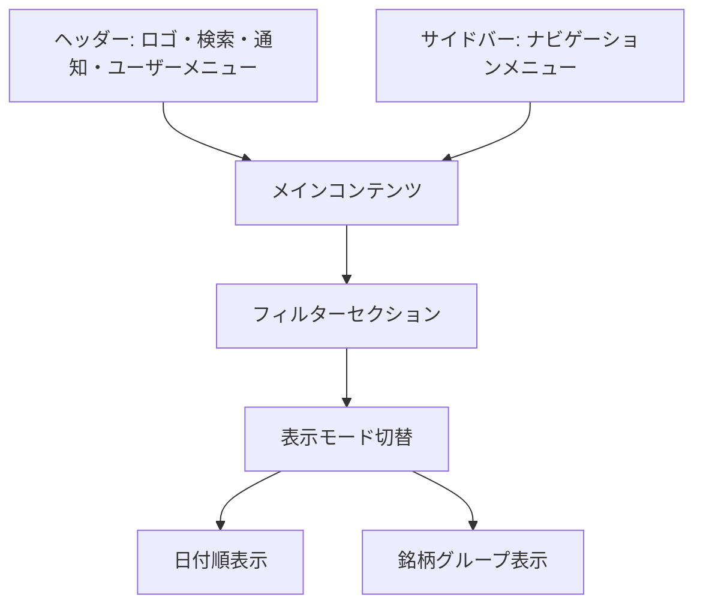

# 画面詳細設計書：トレード一覧画面

## 1. 画面の目的と概要

**目的**：

- ユーザーのすべてのトレード履歴を一覧表示する
- 日付順または銘柄グループ別の表示モードを提供する
- トレードの詳細情報を確認できるようにする
- 新規トレードの登録、既存トレードの編集・削除機能を提供する
- 銘柄ごとのパフォーマンスを視覚的に把握できるようにする

**概要**：
トレード一覧画面は、ユーザーが登録したすべてのトレードデータを管理するための中心的な画面です。日付順表示と銘柄グループ表示の 2 つのモードを切り替えることができ、それぞれのモードで最適化された表示形式を提供します。また、フィルタリングや検索機能により、特定の条件に合致するトレードを素早く見つけることができます。

## 2. 画面レイアウト



## 3. 主要コンポーネント

### 3.1 ヘッダー

- **ロゴ**: アプリケーション名「Trade Manager」とアイコン
- **検索バー**: 銘柄検索機能
- **通知アイコン**: 未読通知の表示
- **ユーザーアバター**: クリックでユーザーメニューを表示

### 3.2 サイドバー

- **ナビゲーションメニュー**:
  - ダッシュボード
  - トレード一覧（現在のページ、アクティブ状態）
  - 月次サマリー
  - 設定

### 3.3 フィルターセクション

- **期間フィルター**:

  - プリセット選択（今月、先月、過去 3 ヶ月、過去 6 ヶ月、今年、すべて）
  - カスタム期間選択（開始日・終了日）

- **銘柄フィルター**:

  - 銘柄名/コード入力フィールド
  - 銘柄セクター選択ドロップダウン

- **取引種別フィルター**:

  - 現物/信用のチェックボックス

- **売買種別フィルター**:

  - 買い/売りのチェックボックス

- **損益フィルター**:

  - 利益のみ/損失のみ/すべてのラジオボタン

- **フィルターアクション**:
  - 「適用」ボタン
  - 「リセット」ボタン

### 3.4 表示モード切替

- **切替ボタングループ**:

  - 「日付順」ボタン
  - 「銘柄グループ」ボタン

- **アクションボタン**:
  - 「新規トレード」ボタン（プライマリーカラー）

### 3.5 日付順表示モード

- **テーブルヘッダー**:

  - 日付（ソート可能）
  - 銘柄
  - 売買種別
  - 取引種別
  - 金額
  - 損益（売りの場合のみ）
  - 損益率（売りの場合のみ）
  - アクション

- **テーブル行**:

  - 各行はトレード 1 件を表示
  - 銘柄情報には銘柄名、コード、セクター、現在価格、価格変動率を含む
  - 売買種別は色分け（買い: 青、売り: 赤）
  - 損益と損益率は色分け（利益: 緑、損失: 赤）
  - アクションボタン（詳細表示、編集、削除）

- **ページネーション**:
  - ページ番号
  - 前へ/次へボタン
  - 1 ページあたりの表示件数選択

### 3.6 銘柄グループ表示モード

- **銘柄カード**:

  - 各カードは銘柄 1 つを表示
  - カードヘッダーには銘柄情報（銘柄名、コード、セクター、現在価格、価格変動率）
  - ポジション合計情報（総購入金額、総売却金額、確定損益、確定損益率）
  - 展開/折りたたみ状態の切替

- **タイムライン表示**:

  - 各トレードをタイムライン形式で表示
  - 買いと売りを視覚的に区別（買い: 青丸、売り: 赤丸）
  - 各トレードには日付、売買種別、金額、損益情報を表示
  - トレード間の関連性を線で表現（買いと対応する売り）

- **銘柄カードアクション**:
  - 「詳細表示」ボタン（銘柄詳細画面へ遷移）
  - 「買い増し」ボタン（買い増しフォームを表示）
  - 「売却」ボタン（売却フォームを表示、アクティブポジションがある場合のみ）

### 3.7 新規トレード登録モーダル

- **モーダルヘッダー**:

  - 「新規トレード登録」タイトル
  - 閉じるボタン

- **入力フォーム**:

  - 銘柄コード入力フィールド（入力時に銘柄名自動表示）
  - 売買種別選択（買い/売り）
  - 金額入力フィールド
  - トレード日選択（デフォルトは現在日付）
  - 取引種別選択（現物/信用、デフォルトは現物）
  - 備考入力フィールド（任意）

- **フォームアクション**:
  - 「登録」ボタン（プライマリーカラー）
  - 「キャンセル」ボタン

### 3.8 トレード詳細モーダル

- **モーダルヘッダー**:

  - 「トレード詳細」タイトル
  - 閉じるボタン

- **詳細情報**:

  - トレード ID
  - 銘柄情報（銘柄名、コード、セクター）
  - 売買種別
  - 金額
  - トレード日
  - 取引種別
  - 損益情報（売りの場合のみ）
  - 備考
  - 登録日時
  - 更新日時

- **モーダルアクション**:
  - 「編集」ボタン
  - 「削除」ボタン
  - 「閉じる」ボタン

## 4. 状態管理

### 4.1 表示モード

- **状態**: viewMode（"date" | "symbol"）
- **初期値**: "date"（日付順表示）
- **永続化**: ローカルストレージに保存し、次回訪問時に復元
- **切替方法**: 表示モード切替ボタンをクリック

### 4.2 フィルター状態

- **状態**: filters（オブジェクト）
- **プロパティ**:
  - dateRange: { start: Date | null, end: Date | null }
  - symbol: string
  - sector: string
  - tradeType: string[]
  - actionType: string[]
  - profitFilter: "all" | "profit" | "loss"
- **初期値**: すべて空または初期値（現在月など）
- **永続化**: ローカルストレージに保存し、次回訪問時に復元

### 4.3 ページネーション状態

- **状態**: pagination（オブジェクト）
- **プロパティ**:
  - currentPage: number
  - itemsPerPage: number
  - totalItems: number
- **初期値**: { currentPage: 1, itemsPerPage: 20, totalItems: 0 }

### 4.4 モーダル表示状態

- **状態**:
  - showNewTradeModal: boolean
  - showTradeDetailModal: boolean
  - showEditTradeModal: boolean
  - showDeleteConfirmModal: boolean
- **初期値**: すべて false
- **選択中トレード**: selectedTrade（オブジェクト、詳細/編集/削除対象）

## 5. ユーザーインタラクション

### 5.1 フィルタリング

- フィルター条件を設定し「適用」ボタンをクリックすると、条件に合致するトレードのみを表示
- 「リセット」ボタンをクリックすると、すべてのフィルター条件をクリア
- 期間プリセットをクリックすると、対応する期間が自動設定される

### 5.2 表示モード切替

- 「日付順」ボタンをクリックすると、トレードを日付順にテーブル表示
- 「銘柄グループ」ボタンをクリックすると、銘柄ごとにグループ化してカード表示

### 5.3 トレード操作

- 「新規トレード」ボタンをクリックすると、新規トレード登録モーダルを表示
- テーブル行またはタイムラインのトレードをクリックすると、トレード詳細モーダルを表示
- 「編集」ボタンをクリックすると、トレード編集モーダルを表示
- 「削除」ボタンをクリックすると、削除確認モーダルを表示

### 5.4 銘柄グループ操作

- カードヘッダーをクリックすると、カードの展開/折りたたみを切替
- 「詳細表示」ボタンをクリックすると、銘柄詳細画面に遷移
- 「買い増し」ボタンをクリックすると、選択銘柄の情報が事前入力された新規トレード登録モーダルを表示
- 「売却」ボタンをクリックすると、売却フォームを表示

### 5.5 ソート

- テーブルヘッダーをクリックすると、対応する列でソート
- 再度クリックすると、ソート順を反転（昇順/降順）

### 5.6 ページネーション

- ページ番号をクリックすると、対応するページに移動
- 前へ/次へボタンをクリックすると、前/次のページに移動
- 1 ページあたりの表示件数を変更すると、ページネーションを再計算

## 6. レスポンシブ対応方針

### 6.1 デスクトップ（1200px 以上）

- フルレイアウト表示
- フィルターセクションを横並びに表示
- テーブルをフル表示
- 銘柄カードを 3 カラムで表示

### 6.2 タブレット（768px〜1199px）

- サイドバーを折りたたみ可能に（ハンバーガーメニュー）
- フィルターセクションを 2 行に分割
- テーブルをスクロール可能に
- 銘柄カードを 2 カラムで表示

### 6.3 モバイル（767px 以下）

- サイドバーをオフキャンバスメニューとして実装
- フィルターセクションをアコーディオン形式に変更
- テーブルを横スクロール可能に、一部の列を非表示または省略表示
- 銘柄カードを 1 カラムで表示
- モーダルをフルスクリーン表示

## 7. データ要件

### 7.1 トレードデータ

```typescript
interface Trade {
  id: number;
  date: string; // トレード日（YYYY/MM/DD形式）
  symbol: string; // 銘柄名
  code: string; // 銘柄コード
  sector: string; // セクター
  currentPrice: number; // 現在価格
  priceChange: number; // 価格変動率（%）
  action: "買い" | "売り"; // 売買種別
  tradeType: "現物" | "信用"; // 取引種別
  amount: number; // 金額
  profit: number | null; // 損益（売りの場合のみ）
  profitRate: number | null; // 損益率（売りの場合のみ）
  notes: string | null; // 備考
  position_id: number | null; // 関連ポジションID
  created_at: string; // 登録日時
  updated_at: string; // 更新日時
}
```

### 7.2 銘柄グループデータ

```typescript
interface StockGroup {
  symbol: string; // 銘柄名
  code: string; // 銘柄コード
  sector: string; // セクター
  currentPrice: number; // 現在価格
  priceChange: number; // 価格変動率（%）
  totalBuyAmount: number; // 総購入金額
  totalSellAmount: number; // 総売却金額
  realizedProfit: number; // 確定損益
  realizedProfitRate: number; // 確定損益率
  hasActivePosition: boolean; // アクティブポジションの有無
  trades: Trade[]; // 関連するトレード配列
}
```

### 7.3 フィルター条件データ

```typescript
interface FilterConditions {
  dateRange: {
    start: string | null; // 開始日（YYYY-MM-DD形式）
    end: string | null; // 終了日（YYYY-MM-DD形式）
  };
  symbol: string; // 銘柄名/コード
  sector: string; // セクター
  tradeType: ("現物" | "信用")[]; // 取引種別配列
  actionType: ("買い" | "売り")[]; // 売買種別配列
  profitFilter: "all" | "profit" | "loss"; // 損益フィルター
}
```

## 8. API 連携

### 8.1 データ取得 API

- **トレード一覧取得**:
  - エンドポイント: `/api/trades`
  - メソッド: GET
  - パラメータ:
    - filters: FilterConditions 型の JSON オブジェクト
    - view_mode: "date" | "symbol"
    - page: number（ページ番号、日付順表示時のみ）
    - per_page: number（1 ページあたりの件数、日付順表示時のみ）
    - sort_by: string（ソート列、日付順表示時のみ）
    - sort_order: "asc" | "desc"（ソート順、日付順表示時のみ）
  - レスポンス:
    - 日付順表示時: { trades: Trade[], total: number, page: number, per_page: number }
    - 銘柄グループ表示時: { stock_groups: StockGroup[] }

### 8.2 トレード操作 API

- **新規トレード登録**:

  - エンドポイント: `/api/trades`
  - メソッド: POST
  - ボディ: 新規トレードデータ
  - レスポンス: 作成されたトレードオブジェクト

- **トレード詳細取得**:

  - エンドポイント: `/api/trades/{id}`
  - メソッド: GET
  - レスポンス: Trade 型の JSON オブジェクト

- **トレード更新**:

  - エンドポイント: `/api/trades/{id}`
  - メソッド: PUT
  - ボディ: 更新トレードデータ
  - レスポンス: 更新されたトレードオブジェクト

- **トレード削除**:
  - エンドポイント: `/api/trades/{id}`
  - メソッド: DELETE
  - レスポンス: 成功メッセージ

### 8.3 銘柄情報 API

- **銘柄検索**:

  - エンドポイント: `/api/stocks/search`
  - メソッド: GET
  - パラメータ: query（検索キーワード）
  - レスポンス: 銘柄情報の配列

- **銘柄詳細取得**:
  - エンドポイント: `/api/stocks/{code}`
  - メソッド: GET
  - レスポンス: 銘柄詳細情報

## 9. エラーハンドリング

### 9.1 データ取得エラー

- **エラー表示**:
  - エラーメッセージをトースト通知で表示
  - 再試行ボタンを提供
  - オフライン時はキャッシュデータを表示（可能な場合）

### 9.2 フォームバリデーションエラー

- **入力フィールド単位**:

  - エラーメッセージを該当フィールドの下に赤文字で表示
  - エラーのあるフィールドを赤枠で強調

- **フォーム全体**:
  - 送信時のサーバーエラーはフォーム上部に表示
  - 具体的なエラー内容と対処方法を提示

### 9.3 操作エラー

- **削除失敗**:

  - エラー理由と対処方法をモーダルで表示
  - 特に関連データがある場合の依存関係を説明

- **更新競合**:
  - 他のユーザーまたは別セッションで同時編集された場合の競合解決 UI
  - 最新データの再取得オプション

## 10. パフォーマンス最適化

### 10.1 データ読み込み

- **スケルトンローディング**:

  - データ取得中はスケルトン UI を表示
  - 各セクション（テーブル行、カード）ごとにスケルトンを表示
  - アニメーション効果（パルス/シマー）を適用

- **遅延読み込み**:
  - 銘柄グループ表示時、初期状態では折りたたまれたカードのみ表示
  - カード展開時に詳細データを非同期で取得

### 10.2 データキャッシング

- **フィルター結果キャッシュ**:

  - 同一フィルター条件の結果をメモリにキャッシュ
  - React Query などを使用したキャッシュ戦略の実装

- **銘柄情報キャッシュ**:
  - 頻繁に使用される銘柄情報をローカルストレージにキャッシュ
  - 定期的な更新（例: 1 日 1 回）

### 10.3 仮想スクロール

- **大量データ対応**:
  - 日付順表示時、仮想スクロールを実装
  - 画面に表示される行のみをレンダリング
  - React Virtual などのライブラリを使用

## 11. アクセシビリティ対応

- 適切な ARIA ロールと属性の設定
- キーボードナビゲーションのサポート
- スクリーンリーダー対応のテーブルマークアップ
- 色だけに依存しない情報伝達（アイコンや記号の併用）
- 十分なコントラスト比の確保
- フォーカス状態の視覚的な明示

## 12. デザイン仕様

### 12.1 カラーパレット

- **プライマリーカラー**: #2962FF（アクセントブルー）
- **セカンダリーカラー**: #26A69A（利益表示用グリーン）
- **アクセントカラー**: #EF5350（損失表示用レッド）
- **背景色**: #1E222D（ダークベース）
- **カード背景**: #2A2E39（セカンダリー背景）
- **ボーダー色**: #363A45（区切り線）
- **テキスト色**:
  - メインテキスト: #D1D4DC
  - サブテキスト: #787B86
  - 強調テキスト: #FFFFFF

### 12.2 タイポグラフィ

- **見出し**: Inter, sans-serif（太字）
- **本文**: Inter, sans-serif（標準）
- **数値**: Roboto Mono, monospace（等幅フォント）

### 12.3 アイコン

- Lucide React アイコンライブラリを使用
- サイズ:
  - 大: 24px（ヘッダー、サイドバー）
  - 中: 20px（ボタン内）
  - 小: 16px（テーブル内、補足情報）

### 12.4 アニメーションとトランジション

- ホバー時の微細なトランジション（150ms）
- カード展開/折りたたみのスムーズなアニメーション（200ms）
- モーダル表示/非表示のフェードエフェクト（150ms）
- スケルトンローディングのパルスアニメーション
