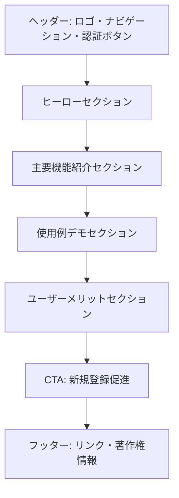

# 画面詳細設計書：ランディングページ

## 1. 画面の目的と概要

**目的**：

- 未ログインユーザーに対してアプリケーションの価値提案を明確に伝える
- 新規登録とログインへの明確な導線を提供する
- アプリケーションの主要機能と特徴を視覚的に紹介する

**概要**：
シンプルで魅力的なデザインのランディングページ。株式トレード管理の効率化という価値提案を前面に出し、TradingView 風のダークテーマを採用した洗練された UI を印象付ける。スクロールダウンで詳細な機能紹介を表示する一方、常に登録/ログインアクションへのアクセスを確保する。

## 2. 画面レイアウト

## 3. 主要コンポーネント

### 3.1 ヘッダー

- **ロゴ**: アプリケーション名「Trade Manager」とアイコン
- **ナビゲーションリンク**: 機能、特徴、よくある質問
- **認証ボタン**:
  - 「ログイン」ボタン（セカンダリーデザイン）
  - 「無料登録」ボタン（プライマリーデザイン、強調表示）

### 3.2 ヒーローセクション

- **キャッチコピー**: 「株式トレード管理をシンプルに、効率的に」
- **サブコピー**: 「複雑な売買パターンも最小限の入力で管理。月次パフォーマンスを一目で把握。」
- **CTA（Call to Action）ボタン**: 「今すぐ始める」（新規登録フォームへ誘導）
- **背景**: TradingView 風のダークテーマにグラフィカル要素を配置

### 3.3 主要機能紹介セクション

- **3 つのカード形式**:
  1. **簡単データ入力**: アイコン + 「最小限の入力でトレードを記録」+ 簡単な説明文
  2. **ポジション管理**: アイコン + 「買い増し・一部売却も自動計算」+ 簡単な説明文
  3. **パフォーマンス分析**: アイコン + 「月次サマリーで成績を把握」+ 簡単な説明文

### 3.4 使用例デモセクション

- **アプリケーションのスクリーンショット**: ダッシュボード、トレード一覧、月次サマリーの画面キャプチャ
- **簡潔な説明**: 各画面の主要機能と利点を説明するテキスト
- **インタラクティブ要素**: タブ切り替えで異なる画面を表示できる仕組み

### 3.5 ユーザーメリットセクション

- **メリットリスト**:
  - 「スプレッドシートからの解放」: データ入力の効率化
  - 「複雑な売買パターンに対応」: 買い増し・一部売却の簡易管理
  - 「パフォーマンス把握の容易さ」: 自動計算された月次サマリー
  - 「どこからでもアクセス可能」: レスポンシブデザインによるマルチデバイス対応

### 3.6 CTA（新規登録促進）セクション

- **強調見出し**: 「今すぐトレード管理を始めましょう」
- **サブテキスト**: 「無料アカウントですべての機能をお試しいただけます」
- **大きな CTA ボタン**: 「無料登録」（新規登録フォームへ誘導）
- **補足テキスト**: 「登録は 30 秒で完了します」

### 3.7 フッター

- **リンク**: プライバシーポリシー、利用規約、お問い合わせ
- **ソーシャルメディアアイコン**: 各 SNS へのリンク（必要に応じて）
- **著作権情報**: © 2025 Trade Manager

## 4. ユーザーインタラクション

### 4.1 ナビゲーション

- ヘッダーのナビゲーションリンクをクリックすると、対応するセクションにスムーズスクロール
- ロゴをクリックすると、ページ最上部に戻る

### 4.2 認証フロー

- 「ログイン」ボタンクリック → ログインフォームへ遷移
- 「無料登録」ボタンクリック → 新規登録フォームへ遷移
- CTA ボタン「今すぐ始める」クリック → 新規登録フォームへ遷移

### 4.3 デモセクション

- タブをクリックすると、対応する画面のスクリーンショットと説明に切り替わる
- スクリーンショットをクリックすると拡大表示

## 5. レスポンシブ対応方針

### 5.1 デスクトップ（1200px 以上）

- フルレイアウト表示
- 3 カラムの機能紹介カード
- デモセクションは横並びのタブとスクリーンショット

### 5.2 タブレット（768px〜1199px）

- ヘッダーのナビゲーションはハンバーガーメニューに変更
- 2 カラムの機能紹介カード
- デモセクションは縦並びに変更

### 5.3 モバイル（767px 以下）

- すべてのセクションを縦並びに再構成
- 機能紹介カードは 1 カラム
- CTA ボタンを画面幅いっぱいに拡大
- デモスクリーンショットはスワイプで切り替え可能なカルーセルに変更

## 6. デザイン仕様

### 6.1 カラーパレット

- **プライマリーカラー**: #2962FF（アクセントブルー）
- **セカンダリーカラー**: #26A69A（利益表示用グリーン）
- **アクセントカラー**: #EF5350（損失表示用レッド）
- **背景色**: #1E222D（ダークベース）
- **セカンダリー背景**: #2A2E39（カード背景など）
- **テキスト色**: #D1D4DC（メインテキスト）、#787B86（サブテキスト）

### 6.2 タイポグラフィ

- **見出し**: Inter, sans-serif（太字）
- **本文**: Inter, sans-serif（標準）
- **アクセント**: Roboto Mono, monospace（数値表示用）

### 6.3 アニメーション

- スクロールに応じたフェードイン効果
- ホバー時の微細なトランジション
- CTA ボタンの注目を集めるパルスアニメーション

## 7. 技術仕様

- React + TypeScript で実装
- TailwindCSS によるスタイリング
- レスポンシブデザイン対応
- アニメーションは CSS Transition を使用
- ルーティングは React Router を使用（ログイン/登録フォームへの遷移）

## 8. 補足事項

- SEO 対策として適切なメタタグを設定
- ページ読み込み速度の最適化（画像の最適化、遅延読み込みなど）
- アクセシビリティへの配慮（適切な alt 属性、キーボードナビゲーション対応など）
- ダークテーマをベースとしつつ、コントラスト比に配慮した可読性の高いデザイン
