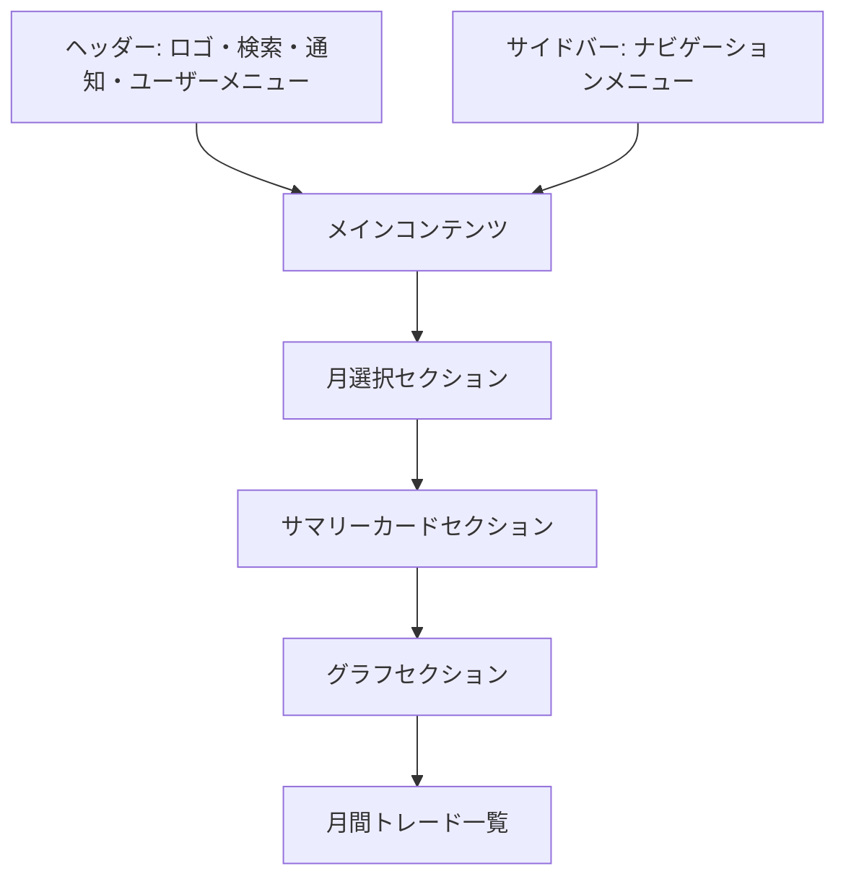

# 画面詳細設計書：月次サマリー画面

## 1. 画面の目的と概要

**目的**：

- ユーザーの月次トレードパフォーマンスを視覚的に把握できるようにする
- 主要な指標（平均利益率、平均損失率、総トレード数など）を一目で確認できるようにする
- 前月との比較を可能にし、パフォーマンスの変化を把握できるようにする
- 月ごとのトレンドを視覚的に表示する

**概要**：
月次サマリー画面は、ユーザーのトレード活動の月間パフォーマンスを集約して表示する画面です。主要な指標をカード形式で表示し、グラフを用いて視覚的に理解しやすくします。また、前月との比較機能により、パフォーマンスの変化を把握できます。レスポンシブデザインにより、スマートフォンでも快適に利用できます。

## 2. 画面レイアウト



## 3. 主要コンポーネント

### 3.1 ヘッダー

- **ロゴ**: アプリケーション名「Trade Manager」とアイコン
- **検索バー**: 銘柄検索機能
- **通知アイコン**: 未読通知の表示
- **ユーザーアバター**: クリックでユーザーメニューを表示

### 3.2 サイドバー

- **ナビゲーションメニュー**:
  - ダッシュボード
  - トレード一覧
  - 月次サマリー（現在のページ、アクティブ状態）
  - 設定

### 3.3 月選択セクション

- **月選択コントロール**:

  - 前月ボタン（<）
  - 現在選択中の年月表示（例: 2025 年 3 月）
  - 次月ボタン（>）
  - 月選択ドロップダウン（カレンダー形式で過去の月を選択可能）

- **比較オプション**:
  - 「前月と比較」トグルスイッチ

### 3.4 サマリーカードセクション

6 つのカードを横並びに配置（レスポンシブ対応）:

1. **総トレード数**:

   - 数値表示（例: 12 件）
   - 前月比の変化率（例: +20%）
   - 上昇/下降を示すアイコンと色分け

2. **総利益**:

   - 金額表示（例: +¥43,850）
   - 前月比の変化率（例: +15.2%）
   - 上昇/下降を示すアイコンと色分け

3. **平均利益率**:

   - パーセンテージ表示（例: 7.6%）
   - 前月比の変化率（例: +1.2%）
   - 上昇/下降を示すアイコンと色分け

4. **平均損失率**:

   - パーセンテージ表示（例: -3.2%）
   - 前月比の変化率（例: +0.5%）
   - 上昇/下降を示すアイコンと色分け（改善は緑、悪化は赤）

5. **最大利益率**:

   - パーセンテージ表示（例: 12.5%）
   - 銘柄名表示（例: トヨタ自動車）
   - 前月比の変化率（例: +2.5%）

6. **最大損失率**:
   - パーセンテージ表示（例: -8.3%）
   - 銘柄名表示（例: ソニーグループ）
   - 前月比の変化率（例: +1.7%）

### 3.5 グラフセクション

- **タブ切替**:

  - 「利益率分布」タブ
  - 「日別パフォーマンス」タブ
  - 「銘柄別パフォーマンス」タブ

- **利益率分布グラフ**:

  - 横軸: 利益率の範囲（-20%〜+20%など）
  - 縦軸: トレード数
  - 棒グラフ形式
  - 利益は緑、損失は赤で色分け
  - 前月比較時は半透明で前月データを重ねて表示

- **日別パフォーマンスグラフ**:

  - 横軸: 日付
  - 縦軸: 日次利益額
  - 折れ線グラフ形式
  - 利益日は緑、損失日は赤でマーカー表示
  - 前月比較時は別の折れ線で前月データを表示

- **銘柄別パフォーマンスグラフ**:
  - 横軸: 銘柄名
  - 縦軸: 利益額
  - 棒グラフ形式
  - 利益は緑、損失は赤で色分け
  - 前月比較時は隣に半透明で前月データを表示

### 3.6 月間トレード一覧

- **テーブルヘッダー**:

  - 日付（ソート可能）
  - 銘柄
  - 売買種別
  - 金額
  - 損益（売りの場合のみ）
  - 損益率（売りの場合のみ）

- **テーブル行**:

  - 各行はトレード 1 件を表示
  - 銘柄情報には銘柄名、コード、セクターを含む
  - 売買種別は色分け（買い: 青、売り: 赤）
  - 損益と損益率は色分け（利益: 緑、損失: 赤）

- **ページネーション**:
  - ページ番号
  - 前へ/次へボタン
  - 1 ページあたりの表示件数選択

## 4. 状態管理

### 4.1 月選択状態

- **状態**: selectedMonth（オブジェクト）
- **プロパティ**:
  - year: number
  - month: number
- **初期値**: 現在の年月
- **永続化**: URL パラメータに保存（例: ?year=2025&month=3）

### 4.2 比較表示状態

- **状態**: compareWithPrevMonth（boolean）
- **初期値**: false
- **永続化**: ローカルストレージに保存

### 4.3 グラフタブ状態

- **状態**: activeGraphTab（string）
- **初期値**: "profit-distribution"（利益率分布）
- **永続化**: ローカルストレージに保存

### 4.4 データ読み込み状態

- **状態**: isLoading（boolean）
- **初期値**: true
- **変化タイミング**:
  - ページ読み込み開始時: true
  - データ取得完了時: false
- **表示**: スケルトンローディングの表示/非表示
  - 各セクション（サマリーカード、グラフ、テーブル）ごとにスケルトンを表示
  - アニメーション効果（パルス/シマー）を適用

## 5. ユーザーインタラクション

### 5.1 月選択

- 前月/次月ボタンをクリックすると、選択月を変更
- 月選択ドロップダウンをクリックすると、カレンダー形式で過去の月を選択可能
- 月を変更すると、すべてのデータ（サマリーカード、グラフ、トレード一覧）が更新される

### 5.2 比較表示切替

- 「前月と比較」トグルスイッチをクリックすると、比較表示のオン/オフを切替
- オンにすると、サマリーカードに前月比が表示され、グラフに前月データが追加される

### 5.3 グラフタブ切替

- タブをクリックすると、対応するグラフを表示
- グラフ内のデータポイントにホバーすると、詳細情報をツールチップで表示
- 銘柄別パフォーマンスグラフの銘柄名をクリックすると、その銘柄の詳細画面に遷移

### 5.4 トレード一覧操作

- テーブル行をクリックすると、トレード詳細モーダルを表示
- 日付ヘッダーをクリックすると、日付でソート（昇順/降順）
- ページネーションコントロールで、ページ間を移動

## 6. レスポンシブ対応方針

### 6.1 デスクトップ（1200px 以上）

- サマリーカードを 3×2 または 6×1 で表示
- グラフを大きく表示
- トレード一覧をフル表示
- サイドバーを常に表示

### 6.2 タブレット（768px〜1199px）

- サマリーカードを 3×2 で表示
- グラフを適切なサイズに調整
- テーブルをスクロール可能に
- サイドバーを折りたたみ可能に（ハンバーガーメニュー）

### 6.3 モバイル（767px 以下）

- サマリーカードを 2×3 または 1×6 で縦に表示
- グラフを画面幅に合わせて調整
- テーブルを横スクロール可能に、一部の列を非表示または省略表示
- サイドバーをオフキャンバスメニューとして実装

## 7. データ要件

### 7.1 月次サマリーデータ

```typescript
interface MonthlySummary {
  year: number; // 年
  month: number; // 月
  totalTrades: number; // 総トレード数
  totalProfit: number; // 総利益
  avgProfit: number; // 平均利益
  avgProfitRate: number; // 平均利益率
  avgLossRate: number; // 平均損失率
  maxProfitRate: number; // 最大利益率
  maxProfitStock: {
    // 最大利益銘柄
    code: string;
    name: string;
  };
  maxLossRate: number; // 最大損失率
  maxLossStock: {
    // 最大損失銘柄
    code: string;
    name: string;
  };
  prevMonthChange: {
    // 前月比変化
    totalTrades: number; // 総トレード数変化率
    totalProfit: number; // 総利益変化率
    avgProfitRate: number; // 平均利益率変化
    avgLossRate: number; // 平均損失率変化
    maxProfitRate: number; // 最大利益率変化
    maxLossRate: number; // 最大損失率変化
  } | null;
}
```

### 7.2 グラフデータ

```typescript
// 利益率分布データ
interface ProfitDistribution {
  ranges: {
    // 利益率範囲ごとのデータ
    range: string; // 範囲ラベル（例: "-10%〜-5%"）
    count: number; // トレード数
    isProfit: boolean; // 利益か損失か
  }[];
  prevMonth?: {
    // 前月データ（比較表示時）
    ranges: {
      range: string;
      count: number;
      isProfit: boolean;
    }[];
  };
}

// 日別パフォーマンスデータ
interface DailyPerformance {
  days: {
    // 日ごとのデータ
    date: string; // 日付
    profit: number; // 利益額
    isProfit: boolean; // 利益か損失か
  }[];
  prevMonth?: {
    // 前月データ（比較表示時）
    days: {
      date: string;
      profit: number;
      isProfit: boolean;
    }[];
  };
}

// 銘柄別パフォーマンスデータ
interface StockPerformance {
  stocks: {
    // 銘柄ごとのデータ
    code: string; // 銘柄コード
    name: string; // 銘柄名
    profit: number; // 利益額
    isProfit: boolean; // 利益か損失か
  }[];
  prevMonth?: {
    // 前月データ（比較表示時）
    stocks: {
      code: string;
      name: string;
      profit: number;
      isProfit: boolean;
    }[];
  };
}
```

### 7.3 月間トレードデータ

```typescript
interface MonthlyTrade {
  id: number;
  date: string; // トレード日（YYYY/MM/DD形式）
  symbol: string; // 銘柄名
  code: string; // 銘柄コード
  sector: string; // セクター
  action: "買い" | "売り"; // 売買種別
  amount: number; // 金額
  profit: number | null; // 損益（売りの場合のみ）
  profitRate: number | null; // 損益率（売りの場合のみ）
}
```

## 8. API 連携

### 8.1 データ取得 API

- **月次サマリー取得**:

  - エンドポイント: `/api/monthly-summaries/{year}/{month}`
  - メソッド: GET
  - パラメータ:
    - compare_with_prev: boolean（前月比較データを含めるかどうか）
  - レスポンス: MonthlySummary 型の JSON オブジェクト

- **利益率分布データ取得**:

  - エンドポイント: `/api/monthly-summaries/{year}/{month}/profit-distribution`
  - メソッド: GET
  - パラメータ:
    - compare_with_prev: boolean（前月比較データを含めるかどうか）
  - レスポンス: ProfitDistribution 型の JSON オブジェクト

- **日別パフォーマンスデータ取得**:

  - エンドポイント: `/api/monthly-summaries/{year}/{month}/daily-performance`
  - メソッド: GET
  - パラメータ:
    - compare_with_prev: boolean（前月比較データを含めるかどうか）
  - レスポンス: DailyPerformance 型の JSON オブジェクト

- **銘柄別パフォーマンスデータ取得**:

  - エンドポイント: `/api/monthly-summaries/{year}/{month}/stock-performance`
  - メソッド: GET
  - パラメータ:
    - compare_with_prev: boolean（前月比較データを含めるかどうか）
  - レスポンス: StockPerformance 型の JSON オブジェクト

- **月間トレード一覧取得**:
  - エンドポイント: `/api/trades`
  - メソッド: GET
  - パラメータ:
    - year: number
    - month: number
    - page: number（ページ番号）
    - per_page: number（1 ページあたりの件数）
    - sort_by: string（ソート列）
    - sort_order: "asc" | "desc"（ソート順）
  - レスポンス: { trades: MonthlyTrade[], total: number, page: number, per_page: number }

## 9. エラーハンドリング

### 9.1 データ取得エラー

- **エラー表示**:
  - エラーメッセージをトースト通知で表示
  - 再試行ボタンを提供
  - オフライン時はキャッシュデータを表示（可能な場合）

### 9.2 データなしの状態

- **サマリーデータなし**:

  - 「選択した月のデータがありません」というメッセージを表示
  - 「トレードを登録する」ボタンを提供

- **グラフデータなし**:
  - 「データがありません」というプレースホルダーを表示
  - 空のグラフではなく、適切なメッセージを表示

## 10. パフォーマンス最適化

### 10.1 データ読み込み

- **スケルトンローディング**:

  - データ取得中はスケルトン UI を表示
  - 各セクション（サマリーカード、グラフ、テーブル）ごとにスケルトンを表示
  - アニメーション効果（パルス/シマー）を適用

- **並行データ取得**:
  - サマリーデータとグラフデータを並行して取得
  - React Query の並行クエリ機能を使用

### 10.2 データキャッシング

- **月次データキャッシュ**:
  - 取得した月次データをメモリにキャッシュ
  - React Query などを使用したキャッシュ戦略の実装
  - 5 分程度の短いキャッシュ有効期間を設定（データの鮮度を保つため）

### 10.3 グラフ最適化

- **遅延レンダリング**:
  - 非表示タブのグラフは、タブがアクティブになるまでレンダリングしない
  - 大量データの場合は、データポイントを間引いて表示

## 11. アクセシビリティ対応

- 適切な ARIA ロールと属性の設定
- キーボードナビゲーションのサポート
- スクリーンリーダー対応のグラフ（代替テキスト、ARIA-live リージョン）
- 色だけに依存しない情報伝達（アイコンや記号の併用）
- 十分なコントラスト比の確保
- フォーカス状態の視覚的な明示

## 12. デザイン仕様

### 12.1 カラーパレット

- **プライマリーカラー**: #2962FF（アクセントブルー）
- **セカンダリーカラー**: #26A69A（利益表示用グリーン）
- **アクセントカラー**: #EF5350（損失表示用レッド）
- **背景色**: #1E222D（ダークベース）
- **カード背景**: #2A2E39（セカンダリー背景）
- **ボーダー色**: #363A45（区切り線）
- **テキスト色**:
  - メインテキスト: #D1D4DC
  - サブテキスト: #787B86
  - 強調テキスト: #FFFFFF

### 12.2 タイポグラフィ

- **見出し**: Inter, sans-serif（太字）
- **本文**: Inter, sans-serif（標準）
- **数値**: Roboto Mono, monospace（等幅フォント）

### 12.3 アイコン

- Lucide React アイコンライブラリを使用
- サイズ:
  - 大: 24px（ヘッダー、サイドバー）
  - 中: 20px（ボタン内）
  - 小: 16px（カード内、補足情報）

### 12.4 グラフスタイル

- **共通**:

  - グリッド線: #363A45（薄い色）
  - 軸ラベル: #787B86（サブテキスト色）
  - ツールチップ: #2A2E39 背景、#D1D4DC 文字色

- **利益率分布グラフ**:

  - 利益バー: #26A69A（緑）
  - 損失バー: #EF5350（赤）
  - 前月比較時: 透明度 70%で前月データを表示

- **日別パフォーマンスグラフ**:

  - 折れ線: #2962FF（青）
  - 利益日マーカー: #26A69A（緑）
  - 損失日マーカー: #EF5350（赤）
  - 前月比較時: #787B86（グレー）で前月データを表示

- **銘柄別パフォーマンスグラフ**:
  - 利益バー: #26A69A（緑）
  - 損失バー: #EF5350（赤）
  - 前月比較時: 透明度 70%で前月データを表示

### 12.5 アニメーションとトランジション

- ホバー時の微細なトランジション（150ms）
- タブ切替時のスムーズなフェードエフェクト（200ms）
- グラフデータ更新時のアニメーション（300ms）
- スケルトンローディングのパルスアニメーション
