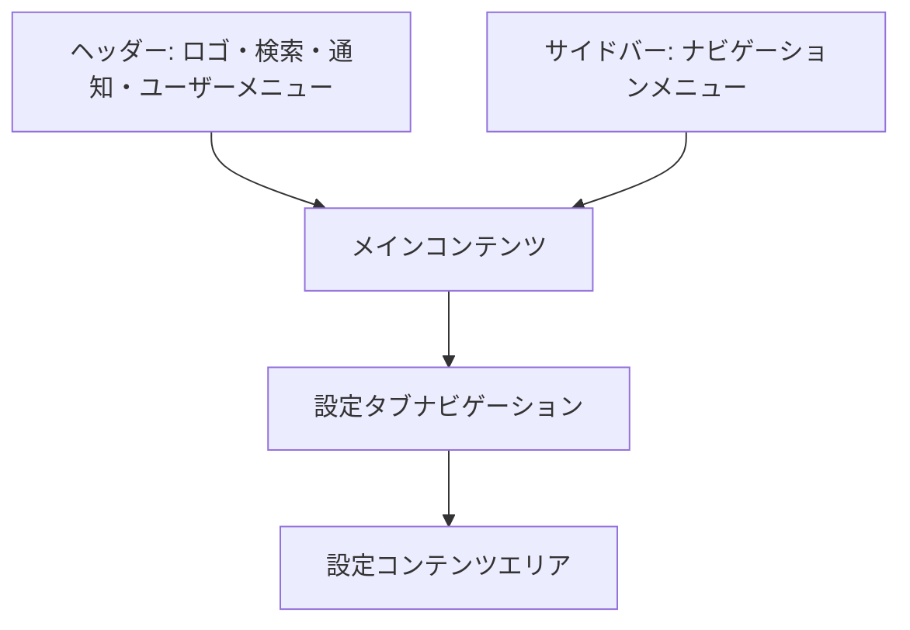

# 画面詳細設計書：設定画面

## 1. 画面の目的と概要

**目的**：

- ユーザーがアカウント情報を管理・更新できるようにする
- パスワードを変更できるようにする
- 必要に応じてアカウントを削除できるようにする

**概要**：
設定画面は、ユーザーがアカウント情報を管理するためのシンプルな画面です。タブ形式で「プロフィール」「パスワード変更」「アカウント削除」の 3 つのセクションに分かれており、必要最小限の機能を提供します。MVP として必要な機能のみを実装し、ユーザーが簡単に設定を変更できるようにします。

## 2. 画面レイアウト



## 3. 主要コンポーネント

### 3.1 ヘッダー

- **ロゴ**: アプリケーション名「Trade Manager」とアイコン
- **検索バー**: 銘柄検索機能
- **通知アイコン**: 未読通知の表示
- **ユーザーアバター**: クリックでユーザーメニューを表示

### 3.2 サイドバー

- **ナビゲーションメニュー**:
  - ダッシュボード
  - トレード一覧
  - 月次サマリー
  - 設定（現在のページ、アクティブ状態）

### 3.3 設定タブナビゲーション

- **タブメニュー**:
  - プロフィール
  - パスワード変更
  - アカウント削除

### 3.4 プロフィール設定タブ

- **プロフィール情報セクション**:

  - プロフィール画像（アップロード/変更機能付き）
  - ユーザー名入力フィールド
  - メールアドレス入力フィールド（変更時は確認メール送信）
  - 表示名入力フィールド

- **保存ボタン**:
  - 「変更を保存」ボタン（プライマリーカラー）
  - 保存成功/失敗メッセージ表示エリア

### 3.5 パスワード変更タブ

- **パスワード変更フォーム**:

  - 現在のパスワード入力フィールド
  - 新しいパスワード入力フィールド
  - 新しいパスワード確認入力フィールド
  - パスワード強度インジケーター

- **変更ボタン**:
  - 「パスワードを変更」ボタン（プライマリーカラー）
  - 変更成功/失敗メッセージ表示エリア

### 3.6 アカウント削除タブ

- **警告セクション**:

  - 警告メッセージ（アカウント削除の影響と取り消し不可能であることを説明）
  - 確認チェックボックス（「アカウントを完全に削除することを理解しました」）

- **削除フォーム**:
  - パスワード入力フィールド（確認のため）
  - 「アカウントを削除」ボタン（アクセントカラー）

## 4. 状態管理

### 4.1 アクティブタブ状態

- **状態**: activeTab（string）
- **初期値**: "profile"（プロフィール）
- **選択肢**: "profile", "password", "delete"
- **永続化**: URL パラメータに保存（例: ?tab=profile）

### 4.2 フォーム状態

- **プロフィールフォーム**:

  - username: string
  - email: string
  - displayName: string
  - profileImage: File | null

- **パスワード変更フォーム**:

  - currentPassword: string
  - newPassword: string
  - confirmPassword: string

- **アカウント削除フォーム**:
  - password: string
  - confirmDelete: boolean

### 4.3 フォーム送信状態

- **状態**:
  - isSubmitting: boolean
  - submitSuccess: boolean | null
  - submitError: string | null
- **初期値**: { isSubmitting: false, submitSuccess: null, submitError: null }

### 4.4 データ読み込み状態

- **状態**: isLoading（boolean）
- **初期値**: true
- **変化タイミング**:
  - ページ読み込み開始時: true
  - データ取得完了時: false
- **表示**: スケルトンローディングの表示/非表示

## 5. ユーザーインタラクション

### 5.1 タブ切替

- 設定タブをクリックすると、対応する設定コンテンツを表示
- タブ切替時に URL パラメータが更新される（例: ?tab=profile → ?tab=password）
- タブ切替時に未保存の変更がある場合は確認ダイアログを表示

### 5.2 プロフィール設定

- プロフィール画像をクリックすると、ファイル選択ダイアログが開く
- 画像選択後、プレビューが表示される
- 入力フィールドの値を変更すると、「変更を保存」ボタンがアクティブになる
- 「変更を保存」ボタンをクリックすると、変更が保存される
- 保存成功時は成功メッセージを表示、失敗時はエラーメッセージを表示

### 5.3 パスワード変更

- 現在のパスワードと新しいパスワードを入力
- 新しいパスワード入力時にパスワード強度が視覚的に表示される
- 「パスワードを変更」ボタンをクリックすると、パスワードが更新される
- 成功時は成功メッセージを表示、失敗時はエラーメッセージを表示

### 5.4 アカウント削除

- 確認チェックボックスをオン
- パスワードを入力
- 「アカウントを削除」ボタンをクリックすると、確認ダイアログが表示される
- 確認後、アカウントが削除され、ログアウトしてランディングページにリダイレクトされる

## 6. レスポンシブ対応方針

### 6.1 デスクトップ（1200px 以上）

- 設定タブを横並びに表示
- フォームフィールドを適切な幅で表示
- サイドバーを常に表示

### 6.2 タブレット（768px〜1199px）

- 設定タブを横並びに表示
- フォームフィールドを画面幅に合わせて調整
- サイドバーを折りたたみ可能に（ハンバーガーメニュー）

### 6.3 モバイル（767px 以下）

- 設定タブをドロップダウンメニューに変更
- フォームフィールドを画面幅いっぱいに表示
- ラベルとフィールドを縦に積み重ねる
- サイドバーをオフキャンバスメニューとして実装

## 7. データ要件

### 7.1 ユーザープロフィールデータ

```typescript
interface UserProfile {
  id: number;
  username: string;
  email: string;
  displayName: string;
  profileImageUrl: string | null;
  createdAt: string;
  updatedAt: string;
}
```

## 8. API 連携

### 8.1 データ取得 API

- **ユーザープロフィール取得**:
  - エンドポイント: `/api/user/profile`
  - メソッド: GET
  - レスポンス: UserProfile 型の JSON オブジェクト

### 8.2 データ更新 API

- **プロフィール更新**:

  - エンドポイント: `/api/user/profile`
  - メソッド: PUT
  - ボディ: 更新プロフィールデータ
  - レスポンス: 更新された UserProfile オブジェクト

- **プロフィール画像アップロード**:

  - エンドポイント: `/api/user/profile/image`
  - メソッド: POST
  - ボディ: FormData（画像ファイル）
  - レスポンス: { imageUrl: string }

- **パスワード変更**:

  - エンドポイント: `/api/user/password`
  - メソッド: PUT
  - ボディ: { currentPassword, newPassword }
  - レスポンス: 成功メッセージ

- **アカウント削除**:
  - エンドポイント: `/api/user`
  - メソッド: DELETE
  - ボディ: { password }
  - レスポンス: 成功メッセージ

## 9. エラーハンドリング

### 9.1 データ取得エラー

- **エラー表示**:
  - エラーメッセージをトースト通知で表示
  - 再試行ボタンを提供

### 9.2 フォームバリデーションエラー

- **入力フィールド単位**:

  - エラーメッセージを該当フィールドの下に赤文字で表示
  - エラーのあるフィールドを赤枠で強調

- **フォーム全体**:
  - 送信時のサーバーエラーはフォーム上部に表示
  - 具体的なエラー内容と対処方法を提示

### 9.3 特殊エラー

- **メールアドレス変更**:

  - 既存アカウントと重複する場合のエラー表示
  - 確認メール送信失敗時のエラー表示と再送オプション

- **パスワード変更**:
  - 現在のパスワードが一致しない場合のエラー表示
  - パスワード強度不足の場合の詳細なガイダンス表示

## 10. パフォーマンス最適化

### 10.1 データ読み込み

- **スケルトンローディング**:
  - データ取得中はスケルトン UI を表示
  - 各セクションごとにスケルトンを表示
  - アニメーション効果（パルス/シマー）を適用

### 10.2 フォーム最適化

- **遅延バリデーション**:

  - フォーカスを失った時点でフィールドのバリデーションを実行
  - 送信時に全フィールドのバリデーションを実行

- **変更検知**:
  - 初期値と現在値を比較して変更があるフィールドのみを送信
  - 変更がない場合は送信をスキップ

## 11. アクセシビリティ対応

- 適切な ARIA ロールと属性の設定
- キーボードナビゲーションのサポート
- フォームラベルとフィールドの適切な関連付け
- エラーメッセージのスクリーンリーダー対応
- 色だけに依存しない情報伝達（アイコンや記号の併用）
- 十分なコントラスト比の確保
- フォーカス状態の視覚的な明示

## 12. デザイン仕様

### 12.1 カラーパレット

- **プライマリーカラー**: #2962FF（アクセントブルー）
- **セカンダリーカラー**: #26A69A（成功表示用グリーン）
- **アクセントカラー**: #EF5350（警告/削除用レッド）
- **背景色**: #1E222D（ダークベース）
- **カード背景**: #2A2E39（セカンダリー背景）
- **ボーダー色**: #363A45（区切り線）
- **テキスト色**:
  - メインテキスト: #D1D4DC
  - サブテキスト: #787B86
  - 強調テキスト: #FFFFFF

### 12.2 タイポグラフィ

- **見出し**: Inter, sans-serif（太字）
- **本文**: Inter, sans-serif（標準）
- **フォームラベル**: Inter, sans-serif（中太）
- **フォームフィールド**: Inter, sans-serif（標準）

### 12.3 アイコン

- Lucide React アイコンライブラリを使用
- サイズ:
  - 大: 24px（ヘッダー、サイドバー）
  - 中: 20px（タブ、セクション見出し）
  - 小: 16px（フォーム要素、補足情報）

### 12.4 フォーム要素スタイル

- **入力フィールド**:

  - 背景: #2A2E39
  - ボーダー: #363A45
  - フォーカス時ボーダー: #2962FF
  - テキスト: #D1D4DC
  - プレースホルダー: #787B86
  - 高さ: 40px
  - 角丸: 4px
  - パディング: 8px 12px

- **ボタン**:
  - プライマリー: #2962FF 背景、#FFFFFF 文字
  - セカンダリー: #2A2E39 背景、#D1D4DC 文字、#363A45 ボーダー
  - 危険: #EF5350 背景、#FFFFFF 文字
  - 無効: #2A2E39 背景、#787B86 文字
  - 高さ: 40px
  - 角丸: 4px
  - パディング: 8px 16px

### 12.5 アニメーションとトランジション

- タブ切替時のスムーズなフェードエフェクト（200ms）
- フォーム送信時のボタンローディングアニメーション
- エラー/成功メッセージのフェードイン/アウト（300ms）
- スケルトンローディングのパルスアニメーション
