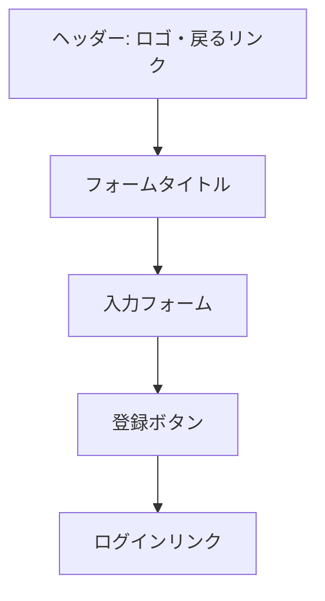
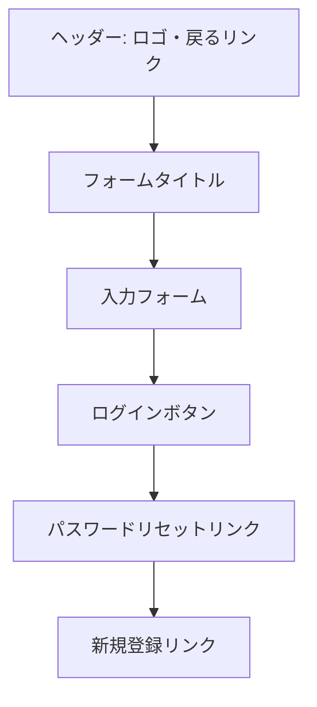
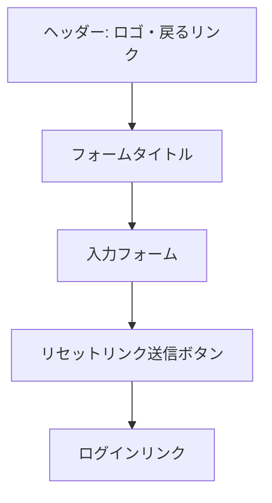

# 画面詳細設計書：認証画面

## 1. 概要

認証画面は、ユーザーがアプリケーションにアクセスするための入り口となる重要な画面群です。新規登録、ログイン、パスワードリセットの 3 つの主要機能を提供し、ユーザーエクスペリエンスを損なわないシンプルで直感的なデザインを採用します。

## 2. 共通デザイン要素

すべての認証画面に共通するデザイン要素：

- TradingView 風のダークテーマ（ランディングページと統一感を持たせる）
- レスポンシブデザイン対応
- エラーメッセージの明確な表示
- 入力フィールドのバリデーション
- アクセシビリティへの配慮

## 3. 新規登録画面

### 3.1 画面の目的

新規ユーザーがアプリケーションにアカウントを作成するためのフォームを提供します。

### 3.2 画面レイアウト

### 3.3 主要コンポーネント

- **ヘッダー**:

  - アプリケーションロゴ
  - ランディングページへ戻るリンク

- **フォームタイトル**:

  - 「新規アカウント登録」の見出し
  - 「簡単な登録で株式トレード管理を始めましょう」のサブテキスト

- **入力フォーム**:

  - ユーザー名（必須）
  - メールアドレス（必須）
  - パスワード（必須）
  - パスワード確認（必須）
  - 利用規約とプライバシーポリシーへの同意チェックボックス

- **登録ボタン**:

  - 「アカウント作成」ボタン（プライマリーカラー）
  - ボタン下に「登録は 30 秒で完了します」の補足テキスト

- **ログインリンク**:
  - 「すでにアカウントをお持ちですか？ログイン」のテキストリンク

### 3.4 入力検証ルール

- **ユーザー名**:

  - 3 文字以上 20 文字以下
  - 英数字、アンダースコア、ハイフンのみ許可

- **メールアドレス**:

  - 有効なメールアドレス形式
  - 既存アカウントとの重複チェック

- **パスワード**:

  - 8 文字以上
  - 英大文字、英小文字、数字、特殊文字を含む
  - パスワード強度インジケーター表示

- **パスワード確認**:
  - パスワードと一致すること

### 3.5 エラーメッセージ

- 入力フィールド直下に赤文字でエラーメッセージを表示
- フォーム送信時のサーバーエラーはフォーム上部に表示

### 3.6 ユーザーフロー

1. ユーザーが必要情報を入力
2. 「アカウント作成」ボタンをクリック
3. 入力検証を実行
4. 検証エラーがある場合は適切なエラーメッセージを表示
5. 検証に成功した場合はアカウント作成処理を実行
6. 作成成功時はダッシュボード画面にリダイレクト
7. メール確認が必要な場合は確認メール送信画面を表示

## 4. ログイン画面

### 4.1 画面の目的

既存ユーザーがアプリケーションにログインするためのフォームを提供します。

### 4.2 画面レイアウト

### 4.3 主要コンポーネント

- **ヘッダー**:

  - アプリケーションロゴ
  - ランディングページへ戻るリンク

- **フォームタイトル**:

  - 「ログイン」の見出し
  - 「アカウントにログインしてトレード管理を続けましょう」のサブテキスト

- **入力フォーム**:

  - メールアドレス（必須）
  - パスワード（必須）
  - ログイン状態を保持するチェックボックス

- **ログインボタン**:

  - 「ログイン」ボタン（プライマリーカラー）

- **パスワードリセットリンク**:

  - 「パスワードをお忘れですか？」のテキストリンク

- **新規登録リンク**:
  - 「アカウントをお持ちでない方は新規登録」のテキストリンク

### 4.4 入力検証ルール

- **メールアドレス**:

  - 有効なメールアドレス形式

- **パスワード**:
  - 空でないこと

### 4.5 エラーメッセージ

- 認証失敗時は「メールアドレスまたはパスワードが正しくありません」とフォーム上部に表示
- 入力フィールド直下に赤文字でフォーマットエラーメッセージを表示

### 4.6 ユーザーフロー

1. ユーザーがメールアドレスとパスワードを入力
2. 「ログイン」ボタンをクリック
3. 入力検証を実行
4. 検証エラーがある場合は適切なエラーメッセージを表示
5. 検証に成功した場合は認証処理を実行
6. 認証成功時はダッシュボード画面にリダイレクト
7. 認証失敗時はエラーメッセージを表示

## 5. パスワードリセット画面

### 5.1 画面の目的

パスワードを忘れたユーザーがパスワードをリセットするためのフォームを提供します。

### 5.2 画面レイアウト

### 5.3 主要コンポーネント

- **ヘッダー**:

  - アプリケーションロゴ
  - ログイン画面へ戻るリンク

- **フォームタイトル**:

  - 「パスワードリセット」の見出し
  - 「登録済みのメールアドレスにリセットリンクを送信します」のサブテキスト

- **入力フォーム**:

  - メールアドレス（必須）

- **リセットリンク送信ボタン**:

  - 「リセットリンクを送信」ボタン（プライマリーカラー）

- **ログインリンク**:
  - 「ログイン画面に戻る」のテキストリンク

### 5.4 入力検証ルール

- **メールアドレス**:
  - 有効なメールアドレス形式

### 5.5 エラーメッセージ

- 入力フィールド直下に赤文字でフォーマットエラーメッセージを表示
- 存在しないメールアドレスの場合も「リセットリンクを送信しました」と表示（セキュリティ上の理由）

### 5.6 ユーザーフロー

1. ユーザーがメールアドレスを入力
2. 「リセットリンクを送信」ボタンをクリック
3. 入力検証を実行
4. 検証エラーがある場合は適切なエラーメッセージを表示
5. 検証に成功した場合はリセットリンク送信処理を実行
6. 「リセットリンクを送信しました」の確認画面を表示

### 5.7 パスワード再設定画面

リセットリンクをクリックした後に表示される画面：

- **フォームタイトル**:

  - 「新しいパスワードの設定」の見出し

- **入力フォーム**:

  - 新しいパスワード（必須）
  - パスワード確認（必須）

- **パスワード更新ボタン**:

  - 「パスワードを更新」ボタン（プライマリーカラー）

- **入力検証ルール**:

  - 新規登録時と同じパスワードルール
  - パスワード確認が一致すること

- **ユーザーフロー**:
  1. ユーザーが新しいパスワードを入力
  2. 「パスワードを更新」ボタンをクリック
  3. 入力検証を実行
  4. 検証に成功した場合はパスワード更新処理を実行
  5. 更新成功時はログイン画面にリダイレクト（成功メッセージ付き）

## 6. レスポンシブ対応方針

### 6.1 デスクトップ（1200px 以上）

- フォームの最大幅を 480px に制限
- 余白を十分に確保し、中央配置
- 入力フィールドの高さを適切に設定

### 6.2 タブレット（768px〜1199px）

- フォームの最大幅を 90%に設定
- 入力フィールドのサイズを維持

### 6.3 モバイル（767px 以下）

- フォームの幅を 95%に設定
- 入力フィールドを縦に積み重ねる
- ボタンを画面幅いっぱいに拡大
- フォントサイズを調整して可読性を確保

## 7. アクセシビリティ対応

- すべての入力フィールドに適切なラベルと aria 属性を設定
- エラーメッセージはスクリーンリーダーでも認識できるよう実装
- キーボードナビゲーションのサポート
- 十分なコントラスト比の確保
- フォーカス状態の視覚的な明示

## 8. セキュリティ対応

- CSRF 対策の実装
- レート制限によるブルートフォース攻撃対策
- パスワードの安全なハッシュ化
- セッション管理の適切な実装
- HTTPS の強制
