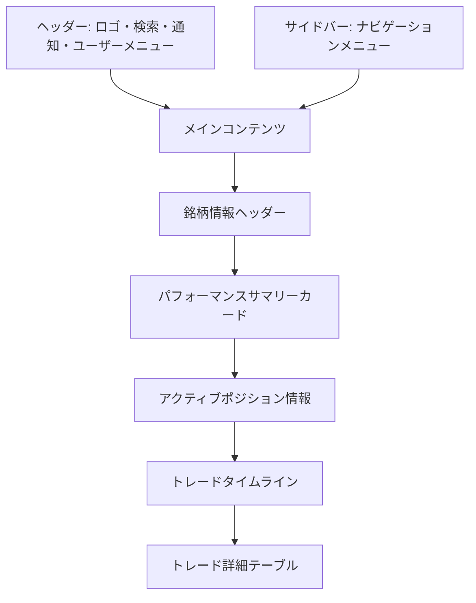

# 画面詳細設計書：銘柄詳細画面

## 1. 画面の目的と概要

**目的**：

- 特定の銘柄に関するすべてのトレード履歴を一覧表示する
- 銘柄ごとのパフォーマンス指標を視覚的に把握できるようにする
- 買いと売りの関連性を視覚的に表現し、トレード戦略を評価できるようにする
- アクティブなポジションがある場合は、現在の状況を確認できるようにする
- 買い増しや売却などの操作を簡単に行えるようにする

**概要**：
銘柄詳細画面は、特定の銘柄に関するすべてのトレード情報を集約して表示する画面です。銘柄の基本情報、パフォーマンス指標、トレード履歴をタイムライン形式で表示し、買いと売りの関連性を視覚的に理解しやすくします。また、アクティブなポジションがある場合は、現在の評価額や損益状況も確認できます。

## 2. 画面レイアウト



## 3. 主要コンポーネント

### 3.1 ヘッダー

- **ロゴ**: アプリケーション名「Trade Manager」とアイコン
- **検索バー**: 銘柄検索機能
- **通知アイコン**: 未読通知の表示
- **ユーザーアバター**: クリックでユーザーメニューを表示

### 3.2 サイドバー

- **ナビゲーションメニュー**:
  - ダッシュボード
  - トレード一覧
  - 月次サマリー
  - 設定

### 3.3 銘柄情報ヘッダー

- **戻るリンク**: トレード一覧画面に戻るリンク
- **銘柄基本情報**:

  - 銘柄名（例: トヨタ自動車）
  - 銘柄コード（例: 7203）
  - セクター（例: 自動車）
  - 現在価格（例: ¥2,550）
  - 価格変動率（例: +1.2%）
  - 株価チャートミニ（直近 1 ヶ月のスパークライン）

- **アクションボタン**:
  - 「買い増し」ボタン（アクティブポジションがある場合）
  - 「新規買い」ボタン（アクティブポジションがない場合）
  - 「売却」ボタン（アクティブポジションがある場合）

### 3.4 パフォーマンスサマリーカード

4 つのカードを横並びに配置:

1. **総トレード数**:

   - 数値表示（例: 8 件）
   - 内訳（買い: 5 件、売り: 3 件）

2. **確定損益**:

   - 金額表示（例: +¥28,850）
   - 損益率（例: +7.8%）
   - 上昇/下降を示すアイコンと色分け

3. **平均保有期間**:

   - 日数表示（例: 12 日）
   - 最長/最短保有期間（例: 最長: 25 日、最短: 3 日）

4. **勝率**:
   - パーセンテージ表示（例: 75%）
   - 内訳（勝ち: 3 件、負け: 1 件）

### 3.5 アクティブポジション情報

アクティブなポジションがある場合のみ表示:

- **ポジション概要**:

  - 取得金額（例: ¥250,000）
  - 現在評価額（例: ¥265,000）
  - 評価損益（例: +¥15,000）
  - 評価損益率（例: +6.0%）
  - 保有日数（例: 18 日）

- **ポジション詳細**:
  - 平均取得単価（例: ¥2,400）
  - 保有数量（例: 104 株）
  - 取得日（例: 2025/02/28）

### 3.6 トレードタイムライン

- **タイムラインヘッダー**:

  - 「トレード履歴」タイトル
  - 表示期間選択（全期間/直近 1 年/直近 6 ヶ月/直近 3 ヶ月）

- **タイムライン表示**:

  - 縦軸: 時間軸（最新のトレードが上部）
  - 買いと売りを視覚的に区別（買い: 青丸、売り: 赤丸）
  - 関連する買いと売りを線で接続
  - 各トレードには日付、売買種別、金額、数量、単価、損益情報を表示
  - 現在のアクティブポジションは特別なマーカーで表示

- **タイムラインフィルター**:
  - 「すべて」「買いのみ」「売りのみ」「利益のみ」「損失のみ」のフィルターボタン

### 3.7 トレード詳細テーブル

- **テーブルヘッダー**:

  - 日付（ソート可能）
  - 売買種別
  - 金額
  - 単価
  - 数量
  - 損益（売りの場合のみ）
  - 損益率（売りの場合のみ）
  - アクション

- **テーブル行**:

  - 各行はトレード 1 件を表示
  - 売買種別は色分け（買い: 青、売り: 赤）
  - 損益と損益率は色分け（利益: 緑、損失: 赤）
  - アクションボタン（詳細表示、編集、削除）

- **ページネーション**:
  - ページ番号
  - 前へ/次へボタン
  - 1 ページあたりの表示件数選択

### 3.8 新規トレード登録/買い増しモーダル

- **モーダルヘッダー**:

  - 「新規買い」または「買い増し」タイトル
  - 閉じるボタン

- **銘柄情報**:

  - 銘柄名、コード、現在価格を表示（自動入力）

- **入力フォーム**:

  - 金額入力フィールド
  - 数量入力フィールド（金額と連動して自動計算）
  - 単価入力フィールド（金額と連動して自動計算）
  - トレード日選択（デフォルトは現在日付）
  - 取引種別選択（現物/信用、デフォルトは現物）
  - 備考入力フィールド（任意）

- **フォームアクション**:
  - 「登録」ボタン（プライマリーカラー）
  - 「キャンセル」ボタン

### 3.9 売却モーダル

- **モーダルヘッダー**:

  - 「売却」タイトル
  - 閉じるボタン

- **ポジション情報**:

  - 現在のポジション状況（取得金額、評価額、評価損益）
  - 平均取得単価、保有数量

- **売却オプション**:

  - 「全売却」ラジオボタン
  - 「一部売却」ラジオボタン

- **入力フォーム**:

  - 売却金額入力フィールド
  - 売却数量入力フィールド（金額と連動して自動計算、一部売却時のみ）
  - 売却単価入力フィールド（金額と連動して自動計算）
  - トレード日選択（デフォルトは現在日付）
  - 取引種別選択（現物/信用、デフォルトは現物）
  - 備考入力フィールド（任意）

- **損益プレビュー**:

  - 予想損益金額
  - 予想損益率
  - 色分け表示（利益: 緑、損失: 赤）

- **フォームアクション**:
  - 「売却実行」ボタン（アクセントカラー）
  - 「キャンセル」ボタン

## 4. 状態管理

### 4.1 銘柄選択状態

- **状態**: selectedStock（オブジェクト）
- **プロパティ**:
  - code: string（銘柄コード）
  - name: string（銘柄名）
- **初期値**: URL パラメータから取得（例: ?code=7203）

### 4.2 表示期間状態

- **状態**: timeRange（string）
- **初期値**: "all"（全期間）
- **選択肢**: "all"（全期間）、"1y"（1 年）、"6m"（6 ヶ月）、"3m"（3 ヶ月）

### 4.3 タイムラインフィルター状態

- **状態**: timelineFilter（string）
- **初期値**: "all"（すべて）
- **選択肢**: "all"（すべて）、"buy"（買いのみ）、"sell"（売りのみ）、"profit"（利益のみ）、"loss"（損失のみ）

### 4.4 モーダル表示状態

- **状態**:
  - showBuyModal: boolean
  - showSellModal: boolean
  - showTradeDetailModal: boolean
  - showEditTradeModal: boolean
  - showDeleteConfirmModal: boolean
- **初期値**: すべて false
- **選択中トレード**: selectedTrade（オブジェクト、詳細/編集/削除対象）

### 4.5 データ読み込み状態

- **状態**: isLoading（boolean）
- **初期値**: true
- **変化タイミング**:
  - ページ読み込み開始時: true
  - データ取得完了時: false
- **表示**: スケルトンローディングの表示/非表示
  - 各セクション（サマリーカード、タイムライン、テーブル）ごとにスケルトンを表示
  - アニメーション効果（パルス/シマー）を適用

## 5. ユーザーインタラクション

### 5.1 銘柄情報

- 戻るリンクをクリックすると、トレード一覧画面に戻る
- 「買い増し」ボタンをクリックすると、買い増しモーダルを表示
- 「新規買い」ボタンをクリックすると、新規トレード登録モーダルを表示
- 「売却」ボタンをクリックすると、売却モーダルを表示

### 5.2 表示期間選択

- 表示期間選択をクリックすると、対応する期間のトレードデータのみを表示
- 期間を変更すると、タイムラインとテーブルの表示内容が更新される

### 5.3 タイムラインフィルター

- フィルターボタンをクリックすると、対応する条件のトレードのみを表示
- フィルターを変更すると、タイムラインとテーブルの表示内容が更新される

### 5.4 タイムライン操作

- タイムライン上のトレードをクリックすると、トレード詳細モーダルを表示
- タイムラインをホバーすると、対応するトレードの詳細情報をツールチップで表示
- 関連する買いと売りの線をホバーすると、その取引の関連性を強調表示

### 5.5 テーブル操作

- テーブル行をクリックすると、トレード詳細モーダルを表示
- 「編集」ボタンをクリックすると、トレード編集モーダルを表示
- 「削除」ボタンをクリックすると、削除確認モーダルを表示
- 日付ヘッダーをクリックすると、日付でソート（昇順/降順）

### 5.6 モーダル操作

- **買い増し/新規買いモーダル**:

  - 金額、数量、単価のいずれかを入力すると、他の値が自動計算される
  - 「登録」ボタンをクリックすると、トレードを登録し、画面を更新
  - 「キャンセル」ボタンをクリックすると、モーダルを閉じる

- **売却モーダル**:
  - 「全売却」を選択すると、すべての保有数量が自動入力される
  - 「一部売却」を選択すると、数量を手動入力できる
  - 金額、数量、単価のいずれかを入力すると、他の値が自動計算される
  - 入力値に応じて、損益プレビューがリアルタイムで更新される
  - 「売却実行」ボタンをクリックすると、売却トレードを登録し、画面を更新
  - 「キャンセル」ボタンをクリックすると、モーダルを閉じる

## 6. レスポンシブ対応方針

### 6.1 デスクトップ（1200px 以上）

- 銘柄情報とアクションボタンを横並びに表示
- パフォーマンスサマリーカードを 4 カラムで表示
- タイムラインとテーブルを大きく表示
- サイドバーを常に表示

### 6.2 タブレット（768px〜1199px）

- 銘柄情報とアクションボタンを横並びに表示（幅を調整）
- パフォーマンスサマリーカードを 2×2 で表示
- タイムラインとテーブルを適切なサイズに調整
- テーブルを横スクロール可能に
- サイドバーを折りたたみ可能に（ハンバーガーメニュー）

### 6.3 モバイル（767px 以下）

- 銘柄情報とアクションボタンを縦に積み重ねる
- パフォーマンスサマリーカードを 1 カラムで縦に表示
- タイムラインを簡略化（関連線を省略）
- テーブルを横スクロール可能に、一部の列を非表示または省略表示
- サイドバーをオフキャンバスメニューとして実装
- モーダルをフルスクリーン表示

## 7. データ要件

### 7.1 銘柄情報データ

```typescript
interface StockInfo {
  code: string; // 銘柄コード
  name: string; // 銘柄名
  sector: string; // セクター
  currentPrice: number; // 現在価格
  priceChange: number; // 価格変動率（%）
  chartData: {
    // ミニチャート用データ
    dates: string[]; // 日付配列
    prices: number[]; // 価格配列
  };
}
```

### 7.2 パフォーマンスサマリーデータ

```typescript
interface StockPerformanceSummary {
  totalTrades: number; // 総トレード数
  buyCount: number; // 買いトレード数
  sellCount: number; // 売りトレード数
  totalProfit: number; // 確定損益合計
  profitRate: number; // 確定損益率
  avgHoldingPeriod: number; // 平均保有期間（日）
  maxHoldingPeriod: number; // 最長保有期間（日）
  minHoldingPeriod: number; // 最短保有期間（日）
  winRate: number; // 勝率（%）
  winCount: number; // 勝ちトレード数
  lossCount: number; // 負けトレード数
}
```

### 7.3 アクティブポジションデータ

```typescript
interface ActivePosition {
  buyAmount: number; // 取得金額
  currentValue: number; // 現在評価額
  unrealizedProfit: number; // 評価損益
  unrealizedProfitRate: number; // 評価損益率（%）
  holdingDays: number; // 保有日数
  avgBuyPrice: number; // 平均取得単価
  quantity: number; // 保有数量
  firstBuyDate: string; // 初回取得日
}
```

### 7.4 トレードデータ

```typescript
interface StockTrade {
  id: number;
  date: string; // トレード日（YYYY/MM/DD形式）
  action: "買い" | "売り"; // 売買種別
  tradeType: "現物" | "信用"; // 取引種別
  amount: number; // 金額
  price: number; // 単価
  quantity: number; // 数量
  profit: number | null; // 損益（売りの場合のみ）
  profitRate: number | null; // 損益率（売りの場合のみ）
  relatedTradeIds: number[]; // 関連トレードID（売りの場合、対応する買いのID）
  notes: string | null; // 備考
  created_at: string; // 登録日時
  updated_at: string; // 更新日時
}
```

## 8. API 連携

### 8.1 データ取得 API

- **銘柄情報取得**:

  - エンドポイント: `/api/stocks/{code}`
  - メソッド: GET
  - レスポンス: StockInfo 型の JSON オブジェクト

- **銘柄パフォーマンスサマリー取得**:

  - エンドポイント: `/api/stocks/{code}/performance-summary`
  - メソッド: GET
  - パラメータ:
    - time_range: string（表示期間、"all"/"1y"/"6m"/"3m"）
  - レスポンス: StockPerformanceSummary 型の JSON オブジェクト

- **アクティブポジション取得**:

  - エンドポイント: `/api/stocks/{code}/active-position`
  - メソッド: GET
  - レスポンス: ActivePosition 型の JSON オブジェクトまたは null

- **銘柄トレード一覧取得**:
  - エンドポイント: `/api/stocks/{code}/trades`
  - メソッド: GET
  - パラメータ:
    - time_range: string（表示期間、"all"/"1y"/"6m"/"3m"）
    - filter: string（フィルター、"all"/"buy"/"sell"/"profit"/"loss"）
    - page: number（ページ番号、テーブル表示時のみ）
    - per_page: number（1 ページあたりの件数、テーブル表示時のみ）
    - sort_by: string（ソート列、テーブル表示時のみ）
    - sort_order: "asc" | "desc"（ソート順、テーブル表示時のみ）
  - レスポンス:
    - タイムライン用: StockTrade[]
    - テーブル用: { trades: StockTrade[], total: number, page: number, per_page: number }

### 8.2 トレード操作 API

- **新規トレード登録**:

  - エンドポイント: `/api/trades`
  - メソッド: POST
  - ボディ: 新規トレードデータ
  - レスポンス: 作成されたトレードオブジェクト

- **トレード詳細取得**:

  - エンドポイント: `/api/trades/{id}`
  - メソッド: GET
  - レスポンス: StockTrade 型の JSON オブジェクト

- **トレード更新**:

  - エンドポイント: `/api/trades/{id}`
  - メソッド: PUT
  - ボディ: 更新トレードデータ
  - レスポンス: 更新されたトレードオブジェクト

- **トレード削除**:
  - エンドポイント: `/api/trades/{id}`
  - メソッド: DELETE
  - レスポンス: 成功メッセージ

## 9. エラーハンドリング

### 9.1 データ取得エラー

- **エラー表示**:
  - エラーメッセージをトースト通知で表示
  - 再試行ボタンを提供
  - オフライン時はキャッシュデータを表示（可能な場合）

### 9.2 フォームバリデーションエラー

- **入力フィールド単位**:

  - エラーメッセージを該当フィールドの下に赤文字で表示
  - エラーのあるフィールドを赤枠で強調

- **フォーム全体**:
  - 送信時のサーバーエラーはフォーム上部に表示
  - 具体的なエラー内容と対処方法を提示

### 9.3 操作エラー

- **売却エラー**:

  - 売却数量が保有数量を超える場合のエラー表示
  - 売却単価が 0 以下の場合のエラー表示

- **削除失敗**:
  - エラー理由と対処方法をモーダルで表示
  - 特に関連データがある場合の依存関係を説明

## 10. パフォーマンス最適化

### 10.1 データ読み込み

- **スケルトンローディング**:

  - データ取得中はスケルトン UI を表示
  - 各セクション（サマリーカード、タイムライン、テーブル）ごとにスケルトンを表示
  - アニメーション効果（パルス/シマー）を適用

- **並行データ取得**:
  - 銘柄情報、パフォーマンスサマリー、アクティブポジション、トレードデータを並行して取得
  - React Query の並行クエリ機能を使用

### 10.2 データキャッシング

- **銘柄データキャッシュ**:
  - 取得した銘柄データをメモリにキャッシュ
  - React Query などを使用したキャッシュ戦略の実装
  - 5 分程度の短いキャッシュ有効期間を設定（データの鮮度を保つため）

### 10.3 タイムライン最適化

- **仮想スクロール**:
  - トレード数が多い場合、仮想スクロールを実装
  - 画面に表示される部分のみをレンダリング
  - React Virtual などのライブラリを使用

## 11. アクセシビリティ対応

- 適切な ARIA ロールと属性の設定
- キーボードナビゲーションのサポート
- スクリーンリーダー対応のタイムライン（代替テキスト、ARIA-live リージョン）
- 色だけに依存しない情報伝達（アイコンや記号の併用）
- 十分なコントラスト比の確保
- フォーカス状態の視覚的な明示

## 12. デザイン仕様

### 12.1 カラーパレット

- **プライマリーカラー**: #2962FF（アクセントブルー）
- **セカンダリーカラー**: #26A69A（利益表示用グリーン）
- **アクセントカラー**: #EF5350（損失表示用レッド）
- **背景色**: #1E222D（ダークベース）
- **カード背景**: #2A2E39（セカンダリー背景）
- **ボーダー色**: #363A45（区切り線）
- **テキスト色**:
  - メインテキスト: #D1D4DC
  - サブテキスト: #787B86
  - 強調テキスト: #FFFFFF

### 12.2 タイポグラフィ

- **見出し**: Inter, sans-serif（太字）
- **本文**: Inter, sans-serif（標準）
- **数値**: Roboto Mono, monospace（等幅フォント）

### 12.3 アイコン

- Lucide React アイコンライブラリを使用
- サイズ:
  - 大: 24px（ヘッダー、サイドバー）
  - 中: 20px（ボタン内）
  - 小: 16px（カード内、補足情報）

### 12.4 タイムラインスタイル

- **タイムライン軸**: #363A45（薄い色）
- **買いノード**: #132742 背景、#2962FF ボーダー（青）
- **売りノード**: #2a1c1c 背景、#EF5350 ボーダー（赤）
- **関連線**:
  - 利益取引: #26A69A（緑）
  - 損失取引: #EF5350（赤）
  - 未確定: #787B86（グレー）
- **アクティブポジションマーカー**: #2962FF（青）の点滅効果

### 12.5 アニメーションとトランジション

- ホバー時の微細なトランジション（150ms）
- タイムラインノードのホバー効果（拡大、ツールチップ表示）
- 関連線のホバー効果（太線化、ハイライト）
- モーダル表示/非表示のフェードエフェクト（200ms）
- スケルトンローディングのパルスアニメーション
